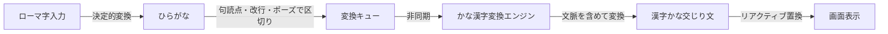
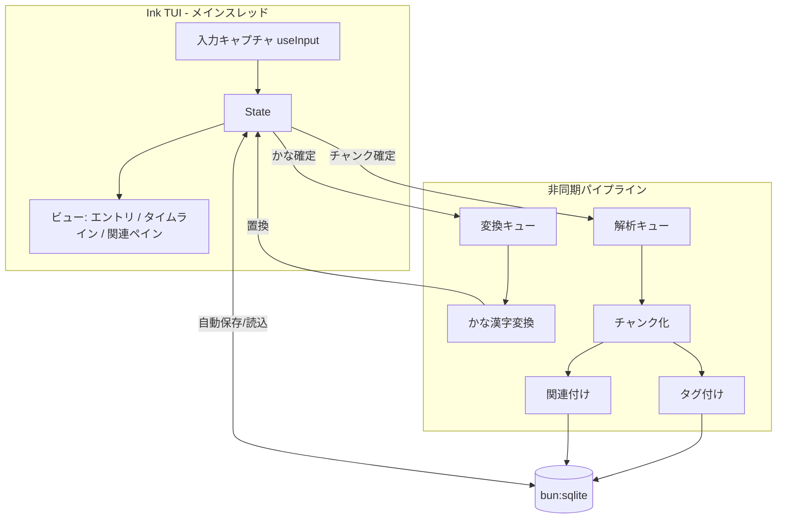

# zakki — ジャーナリング用メモアプリ 構想

v1（[garden](https://github.com/oda251/garden): ノードグラフ ドキュメンテーションツール、Web アプリ）を作り直し、TUI のジャーナリングアプリとして再構築する。

## 最上位プリンシパル

**「考えを入力する以外の操作を可能な限り省く」**

このプリンシパルからの帰結:

| 省く操作                           | 代替                                   |
| ---------------------------------- | -------------------------------------- |
| 保存                               | 自動保存（キーストローク単位で永続化） |
| かな漢字変換（変換キー・候補選択） | 文脈を勘案した自動変換                 |
| ファイル・ノートの作成/命名        | 入力の自動チャンク化                   |
| タグ付け                           | 自動タグ付け                           |
| リンク作成                         | 自動関連付け                           |
| モード切替                         | 起動即入力。常に入力モード             |

判断基準: 機能追加の際、「入力中のユーザーに操作を要求するか」を問う。要求するなら原則却下し、自動化または非同期化を検討する。

## 制約: 運用コストゼロ

完全に無料で稼働させる。機能面はこの制約に合わせて妥協する。

- 有料 API（Claude API 等のクラウド LLM・embedding API）は採用しない
- 極力ローカルエンジンで完結させる
- 非公式 API は無料であれば許容する。ただし無保証のため、停止時にローカル処理へフォールバックできる構成を必須とする

## 形態

- **TUI アプリ**。リアクティブ UI は [OpenTUI](https://github.com/sst/opentui)（React / SolidJS レンダラ + Zig コア。Bun 第一級サポート、CJK 表示幅処理、単行 / 多行テキスト入力、Flexbox レイアウト。OpenCode で本番使用実績）で構築する
  - 当初候補の Ink は Bun 非対応（公式サポート "not planned"、[調査記録 §4](./RESEARCH.md)）のため変更。Ink 採用時はランタイムを Node に変える必要がある
  - Ink / OpenTUI とも IME 変換中表示は未対応だが、v2 はローマ字直接入力で IME を使わないため影響なし
- ランタイムは Bun、ローカル DB は `bun:sqlite`（`~/.references/stack/tech-stack-ts.md` の技術選定に従う）
- ローカルファースト。データはローカル SQLite に保持し、外部送信（変換・タグ付け等の API 利用）は機能単位で制御可能にする
- データは Obsidian vault（`~/obsidian-vault`）へ Markdown として**一方向エクスポート**できる（2026-06-12 確定）。SQLite が source of truth であり、vault 側の編集は取り込まない（`FEATURES.md` §Obsidian エクスポート）

## コア機能

### 1. ローマ字入力 → 自動かな漢字変換

ユーザーは IME を使わずローマ字を打つだけ。変換操作（スペースキー、候補選択、確定）を要求しない。

パイプライン:

設計上の不変条件: **変換はタイピングを一切ブロックしない**。未変換のかな（またはローマ字）を即時表示し、変換結果が返り次第その場で置換する。Ink の state 更新による再描画でこれを実現する。

変換エンジン: **[AzooKeyKanaKanjiConverter](https://github.com/azooKey/AzooKeyKanaKanjiConverter) の公式 CLI `anco` を常駐外部プロセスとして使う**（根拠・深掘り調査は `RESEARCH.md` §1）。

- `anco session` は stdin/stdout のライン指向プロトコルを持ち、`Bun.spawn` から直接統合できる。Ubuntu 24.04 の CI 実績あり。エンジン・辞書とも MIT
- **即時変換**: anco 内蔵の N-gram エンジン + 同梱辞書（文節レベルの文脈考慮）
- **文脈校正**: `--zenz` フラグで [zenz-v3.1-small](https://huggingface.co/Miwa-Keita/zenz-v3.1-small-gguf)（GPT-2 ベース 95M、GGUF 73.9MB、CC-BY-SA 4.0、llama.cpp 実行）を有効化。`:ctx` コマンドで左文脈、`--config_topic` でトピックを渡せる。AJIMEE-Bench Acc@1 で Google 日本語入力を大きく上回る系統の精度（`RESEARCH.md` §1）
- **フォールバック**: zenz モデル未取得時は N-gram のみで動作。完全オフラインで成立

経緯: 当初候補の Google 日本語変換 CGI API は公式廃止宣言 + 規約リスクで不採用。SKK 辞書引き自作案は anco の採用により不要（SKK-JISYO の GPL 問題も消滅）。Mozc（apt で導入可・品質高）は zenz 系の精度が不足した場合の代替（`RESEARCH.md` §1）。

ローマ字→ひらがなは決定的なテーブル変換であり外部依存不要（ヘボン式・訓令式の揺れの吸収を含む）。

英単語の扱い（2026-06-12 確定）:

- 大文字で始まる単語は英単語として扱い、かな変換を行わない
- 英単語はスペースまたは記号（句読点・改行等）まで継続する
- 英単語直後のスペース 1 個は「区切り」として消費し、出力に残さない（`Claude ga` → `Claudeが`）
- 英単語の直後にスペースを残したい場合（英単語の連続等）はスペース 2 個を打ち、1 個に縮約する（`Claude  Code` → `Claude Code`）

### 2. 自動チャンク化

入力ストリームを意味のまとまり（チャンク）へ自動分割する。ユーザーに「ノートを分ける」操作を要求しない。

- 一次区切り: 改行・空行・句点（決定的）
- 二次区切り: 話題転換の検出
  - ローカル embedding の隣接類似度の低下を境界とみなす方式（実現方式は `FEATURES.md` §embedding）
  - 任意: ローカル LLM にチャンク境界とタイトルを同時生成させる方式（未検証）
- 形態素解析が必要な処理（キーワード抽出・タイトル生成等）には [lindera-wasm](https://github.com/lindera/lindera)（Rust 製 WASM、IPAdic 同梱、MIT、メンテ活発。`RESEARCH.md` §3）を使う。タイトルは LLM なしでも「チャンク先頭文 + 抽出キーワード」で決定的に生成できる

チャンクは編集可能だが、分割・結合の修正も自動提案ベースとし、確認操作を最小化する。

### 3. 自動タグ付け・関連付け

- **タグ付け**: チャンク確定時にバックグラウンドで付与。lindera-wasm による名詞抽出 + TF-IDF を基本とし、新規タグの乱立は既存タグ集合への正規化（ローカル embedding 近傍検索）で防ぐ
- **関連付け**: 過去チャンクとの類似度（ローカル embedding、またはタグ共起 + キーワード一致）で閾値以上をリンクする。双方向（バックリンク）

いずれも入力フローの外（非同期ワーカー）で実行し、結果は画面に反映されるだけでユーザー操作を要求しない。

## アーキテクチャ概要

- UI と解析パイプラインはイベント駆動で疎結合。パイプラインの失敗は入力に影響しない（リトライキュー）
- エラーハンドリングは neverthrow の `Result` 型（`~/.references/stack/tech-stack-ts.md`）

## データモデル素案

| テーブル          | 役割                                                                                  |
| ----------------- | ------------------------------------------------------------------------------------- |
| entries           | 1 セッション（日付単位）の生入力ログ。raw（ローマ字/かな）と converted を分離して保持 |
| chunks            | 自動分割された意味単位。title（自動生成）、content、entry への参照                    |
| tags / chunk_tags | v1 の tags / node_tags に相当                                                         |
| links             | chunk 間の関連。score（類似度）と origin（auto / manual）を持つ                       |
| embeddings        | chunk の埋め込みベクトル（BLOB）                                                      |

raw を捨てない理由: 変換・チャンク化は非可逆な自動処理であり、誤変換の事後修正・再処理（エンジン差し替え時の再変換）に原文が必要。

## v1 からの引き継ぎ / 破棄

v2 は本リポジトリ（zakki）として独立。v1 は [oda251/garden](https://github.com/oda251/garden) に残る。

| 項目                                                  | 扱い                                       |
| ----------------------------------------------------- | ------------------------------------------ |
| タグ・関連付けのデータモデル概念                      | 引き継ぐ（自動付与に変更）                 |
| SvelteKit frontend / Hono backend / CF Workers        | 引き継がない（TUI + ローカル SQLite）      |
| 認証（Better Auth / OIDC）                            | 引き継がない（シングルユーザー・ローカル） |
| oxlint / oxfmt / vitest / lefthook 等のツールチェーン | 新リポジトリでも同構成を採用               |
