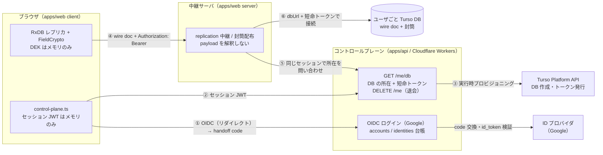
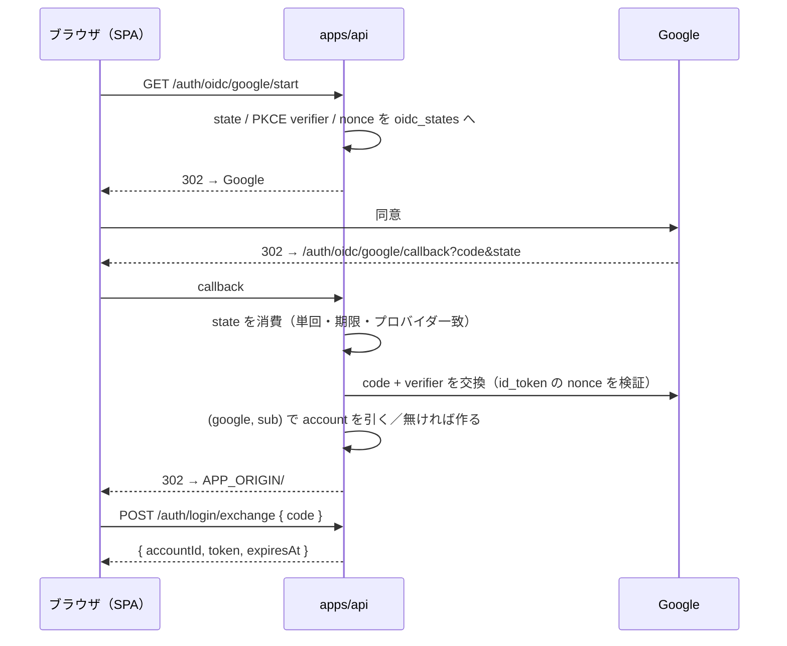

# マルチユーザ構成（コントロールプレーン + DB-per-user）

「スマホ単体で会員登録 → 自分の Turso DB へ読み書き」を成立させる構成。設計の根拠は [RESEARCH.md §6 設計決定 3](RESEARCH.md#設計決定)（Identity 抽象・DB-per-user）と §7（コントロールプレーン）。実装は issue #99〜#105。

**既定は単一ユーザ self-host のまま**で、`ZAKKI_CONTROL_PLANE_URL` を設定したときだけこの構成になる（未設定なら従来どおり LocalIdentity で 1 つの DB を開く）。

## 全体図



### どこに何が無いか（サーバの境界）

**暗号は opt-in で、既定は OFF（平文保管）**（issue #129 / #133）。不変条件は「クラウドには暗号文しか無い」ではなく **「サーバは中身を解釈せず、復号する能力も持たない」**。暗号の ON / OFF でサーバのコードも責務も変わらない。

| 場所                   | あるもの                                        | **無いもの**                |
| ---------------------- | ----------------------------------------------- | --------------------------- |
| コントロールプレーン   | account / 外部 ID（provider, sub）・DB の所在   | DEK・PRF 出力・封筒・本文   |
| 中継サーバ（apps/web） | 不透明な wire doc・封筒（KEK 無しでは開けない） | DEK・PRF 出力・復号する手段 |
| ユーザごと Turso DB    | wire doc そのまま（暗号 ON なら暗号文 + 封筒）  | KEK                         |
| ブラウザ               | DEK（メモリのみ）・セッション JWT（メモリのみ） | 永続化された鍵・トークン    |

「復号する手段が無い」は依存関係のルールで機械的に担保している（`.dependency-cruiser.cjs` の `web-server-no-decrypt-capability`。サーバから DEK・復号・アンロックのモジュールへ推移的にも到達しない）。暗号を既定 OFF に戻してもこのルールは維持する。

暗号 ON / OFF の判定はクライアントが**封筒の数**で行う（サーバは配るだけ）:

| `GET /api/crypto/envelopes` | クライアントの動き                          |
| --------------------------- | ------------------------------------------- |
| 0 件                        | 暗号 OFF。恒等変換で replication を開始する |
| 1 件以上                    | 暗号 ON。アンロックできたときだけ開始する   |
| 取得失敗（オフライン）      | 構成不明。開始しない（local のみで動く）    |

暗号を有効にするには `ZAKKI_ENCRYPTION=1` で TUI を起動する（既存データはその場で暗号化される）。戻すには `just decrypt`（issue #133）。

- ログイン（OIDC）と E2E のアンロックは別物。ログインで得るのは「どのアカウントか」だけで、鍵材料は一切含まない。パスキーは E2E のアンロック専用で、PRF 出力は **認証器 → ブラウザ**の中で閉じる。
- `GET /me/db` が返すトークンは「その DB を開ける権限」であって復号鍵ではない。全部の鍵を失えば復号不能になる（真の E2E のトレードオフ。リカバリコード封筒が必須）。

## 構成要素

| 役割                             | 実体                                                                                                            |
| -------------------------------- | --------------------------------------------------------------------------------------------------------------- |
| Identity 抽象                    | [`packages/core/src/identity/types.ts`](../packages/core/src/identity/types.ts)                                 |
| LocalIdentity                    | [`packages/data/src/identity/local.ts`](../packages/data/src/identity/local.ts)（env / `identity.json`）        |
| RemoteIdentity                   | [`packages/core/src/identity/remote.ts`](../packages/core/src/identity/remote.ts)（`/me/db` の応答 → Identity） |
| コントロールプレーンクライアント | [`apps/web/src/client/api/control-plane.ts`](../apps/web/src/client/api/control-plane.ts)                       |
| 中継先の解決                     | [`apps/web/src/server/identity/remote.ts`](../apps/web/src/server/identity/remote.ts)                           |

### 構成の選択は設定ベース

1. ブラウザは起動時に `GET /api/config` を叩く（中継サーバが自分の設定から `controlPlaneUrl` を返す）。
2. `null` なら従来経路（LocalIdentity 相当。認証なしで自分の 1 つの DB を読む）。
3. 値があれば、URL の fragment に handoff code（`#login=<code>`）があるときだけ交換してログインし、`GET /me/db` の応答を `RemoteIdentity` に写す。code が無い・交換に失敗したときはローカルのみで起動し、「Google でログイン」ボタンを出す（押すと `/auth/oidc/google/start` へ遷移）。

### ログイン（OIDC）

コントロールプレーンのログインは OIDC の Authorization Code + PKCE。以前はパスキー（WebAuthn）だったが、OIDC に置き換えた。



| エンドポイント                      | 役割                                                                    |
| ----------------------------------- | ----------------------------------------------------------------------- |
| `GET /auth/providers`               | ログインに使えるプロバイダ（`[{ id, name }]`）。UI はこれでボタンを出す |
| `GET /auth/oidc/:provider/start`    | 認可エンドポイントへ 302                                                |
| `GET /auth/oidc/:provider/callback` | code 交換 → アカウント解決 → SPA へ handoff code 付きで 302             |
| `POST /auth/login/exchange`         | handoff code（単回・60 秒）をセッション JWT に換える                    |

- **プロバイダは差し替え可能**。ルートは `IdentityProvider` ポート（`apps/api/src/auth/providers/types.ts`）だけを知り、Google は汎用 OIDC アダプタ（`providers/oidc.ts`, oauth4webapi）に issuer と client を渡したもの。別の OIDC プロバイダは合成点（`apps/api/src/index.ts`）で足し、client ID / secret を env（`apps/api/src/env.ts`）に加えるだけで、OIDC でない OAuth2（GitHub 等）はポートを実装するアダプタを書く。
- **アカウントは `(provider, sub)` で同定する**（`account_identities`）。メールは変わりうるので同定に使わず、別プロバイダの同じメールも自動では結ばない。
- **セッション JWT を URL に載せない**。コールバックは使い捨ての handoff code だけを fragment（サーバへ送られない）に載せ、SPA は読んだ直後に `history.replaceState` で消してから POST で交換する。
- state・PKCE verifier・nonce は Workers がリクエスト間で状態を持てないので DB（`oidc_states`, TTL 10 分）に置く。
- 失敗は `APP_ORIGIN/#login_error=<state|denied|provider>` で SPA へ戻す。

E2E 暗号のパスキー（PRF 封筒）はログインと切り離して残してある。封筒の登録・失効は中継の `/api/crypto/envelopes/passkey*` だけで完結する（クレデンシャルの台帳はもう無い）。

### 接続先の切替は「中継の維持」を選んだ

ブラウザから Turso HTTP を直叩きする案もあるが、replication のプロトコル（`POST /api/replication/:collection/pull|push`）・封筒配布・conflict 処理をすべて libSQL 直叩きに書き換えることになる。**変更が小さいのは現行の中継を残す方**なので、ブラウザ → apps/web → ユーザ DB の形を維持し、切り替わるのは中継先だけにした（direct 接続は将来 issue）。

中継サーバへ渡すのは **セッション JWT だけ**で、DB の URL やトークンは渡さない。宛先はサーバがコントロールプレーンに問い合わせて決める（クライアントの申告した URL へ接続する設計にすると、任意の宛先へ繋がせる穴になる）。

### ユーザ DB のプロビジョニング（issue #101 / #130）

`GET /me/db` が台帳（`account_databases`）を引いて、行が無ければ作る。順序は固定で、各段が冪等:

1. **台帳を引く**。ヒットすれば Platform API を一切叩かない（2 回目以降はここで終わる）
2. **group を存在させる**（`ensureGroup`）。引ければ何もせず、無ければ作る。409 は「並行する実行者が先に作った」として成功に畳む
3. **DB を作る**。409（already exists）は「前回の試行が台帳書き込み前に落ちた」として既存 DB を引き当てる
4. **台帳へ書く**

group がアプリの責務なのは、Turso が IaC を提供も推奨もしていないため（issue #129。公式の管理手段は CLI と Platform API だけ）。空の Turso 組織に対しても、最初の会員登録がそのまま group を作って動きだす。ロケーションキーは AWS リージョン形式（東京 = `aws-ap-northeast-1`）で、旧 3 文字コード（`nrt`）は現行 API が 400 `invalid location` で弾く。

クライアント本体は [`packages/core/src/turso/platform.ts`](../packages/core/src/turso/platform.ts)。`apps/api`（Worker）とブートストラップ CLI の両方から使うため core に置く（app 間の import は depcruise で禁じてある）。

### 退会（`DELETE /me`）

会員登録の逆操作（issue #116）。対象は常にセッションの持ち主自身で、相手を指定する引数は無い。

1. 台帳（`account_databases`）から DB 名を引く。行が無ければ `accountId` から決定的に導く（プロビジョニングが「DB 作成 → 台帳書き込み」の順なので、台帳に載っていない DB が実在しうる）
2. Turso Platform API で DB を削除する（`DELETE /v1/organizations/{org}/databases/{db}`。404 は「既に無い」として成功に畳む）
3. `accounts` の行と子行（`account_identities` / `login_handoffs` / `account_databases`）を 1 バッチで明示的に削除する（Turso は外部キー強制が OFF なので cascade に頼らない）

**順序は「DB 削除 → 台帳削除」で固定**。逆順にすると台帳を消した時点で DB 名の出どころが失われ、誰も参照しない・誰も消せない孤児 DB が Turso に残る。DB 削除に失敗したら台帳を残したまま 502 を返す——この状態は「まだ退会していない」だけなので、同じリクエストの再送で続きから完了できる。

退会後もセッション JWT は署名としては最長 12 時間有効なままなので、`requireSession` の直後に台帳を引いて**そのセッションが今も生きているか**を確かめる（`requireActiveSession`。次節）。これが無いと退会直後の `GET /me/db` を `ensureUserDatabase` が「初回」と解釈し、消したはずの DB を作り直してしまう。

### ログアウト・セッション失効（issue #117）

セッションはステートレス JWT（HS256, TTL 12 時間）なので、そのままでは「発行済みトークンを止める」手段が無い。**セッション世代（epoch）** でそれを補う。

| 要素 | 実体                                                                                    |
| ---- | --------------------------------------------------------------------------------------- |
| 台帳 | `accounts.session_epoch`（integer, 既定 0）                                             |
| 発行 | `issueSession` が発行時点の世代を `epoch` claim としてトークンに焼く                    |
| 検証 | `requireActiveSession` が JWT の `epoch` と台帳の現在値を突き合わせ、不一致なら 401     |
| 失効 | `POST /auth/logout`（要セッション）が `session_epoch = session_epoch + 1` の 1 文を実行 |

失効させると、そのアカウントが過去に発行したトークンが全て一斉に「古い世代」になる（＝全端末ログアウト）。

- **セッションテーブルを持たない**のが要点。トークン 1 本ごとの行を書くとログインのたびに書き込みが増え、掃除も要る。世代番号ならアカウント 1 行の整数で「全部無効」を表現できる。
- **アカウント存在確認（#116）と世代照合は同じ 1 行**なので、`requireActiveSession` が 1 クエリで両方見る（`requireLiveAccount` を置き換えた。適用先は `/auth/me`・`/auth/logout`・`/me/db`・`DELETE /me`）。
- 世代の加算は **SQL 側の `+ 1`**。現在値を読んでから書くと、2 台から同時にログアウトしたとき双方が同じ値を書いて世代が 1 つしか進まない（先に発行されたトークンが生き残る）。
- `epoch` claim の**欠落は 401**。「無ければ 0 とみなす」にすると claim を落とすだけで失効を回避できてしまう。
- ログアウトはアカウントもデータも消さない。**再ログインすれば新しい世代のトークンが出て、同じ DB に戻れる**（退会 `DELETE /me` とは別物）。

> [!IMPORTANT]
> **この機能を含むデプロイ時の手順**（既存デプロイがある場合のみ）
>
> 1. **migration 0003 を新コードより先に当てる**。逆順だと `requireActiveSession` が存在しない `session_epoch` を引いて全リクエストが失敗する。
> 2. **既存の発行済みトークンは全ユーザ分が 401 になる**（`epoch` claim を持たないため）。障害ではなく設計どおりで、利用者は再ログインすれば復帰できる。

#### 「この端末だけログアウト」を持たない理由

epoch は**アカウント単位の 1 整数**なので、端末ごとの失効は表現できない（+1 すれば全端末が落ちる）。端末単位を表現するにはトークン 1 本ごとの状態が要り、ステートレスなセッション設計そのものを覆すことになる。

「あの端末を切りたい」は全端末ログアウトで代用する（トークンは最長 12 時間で切れ、再ログインは Google の同意 1 回で済む）。

#### 実効的な失効遅延

| 経路                                                            | 失効までの遅延                                          |
| --------------------------------------------------------------- | ------------------------------------------------------- |
| コントロールプレーン（`/auth/me`・`/me/db`・`DELETE /me`）      | **即時**（次のリクエストから 401）                      |
| 中継サーバ経由（`/api/replication/*`・`/api/crypto/envelopes`） | **最大 60 秒**                                          |
| ブラウザが握ったままの DB トークン（Turso 直叩き）              | 最大 60 分（`GET /me/db` の TTL。失効させる手段が無い） |

中継サーバのキャッシュ（`apps/web/src/server/identity/remote.ts`）はセッション JWT 単位で、ヒット時はコントロールプレーンへ問い合わせない。ここで取り得た選択肢は 3 つ:

1. **キャッシュ TTL を短くする（例 5 分）** — 失効窓は縮むが、切れるたびにユーザ DB ハンドルを開き直す。ハンドルを閉じる手段が無い（`openRemoteDb` は client を返さない）ので、開きっぱなしが 12 倍に増える。
2. **ヒット時も毎回 `/auth/me` を叩く** — 確実だが、replication は 1 操作ごとに pull / push が飛ぶので往復が常時 2 倍になる。
3. **ヒット時も `/auth/me` で検証し、検証結果を 60 秒メモ化する**（採用） — 失効遅延は 60 秒で頭打ち、追加の往復はセッションあたり 60 秒に 1 回、DB ハンドルは従来どおり DB トークンの寿命に 1 つ。

3 を選んだのは 1 と 2 の代償だけを避けられるため。再検証で **401 / 403** を受けた項目はキャッシュごと捨て、DB ハンドルは（接続先も DB トークンの寿命も変わらないので）開き直さない。並列リクエストの再検証は 1 本に束ねる。

失効とみなすのは「このセッションは無効だ」と明示された 401 / 403 だけで、**上流の一時障害（5xx・応答不正・ネットワーク断）ではキャッシュを捨てない**。捨てるとその場が 401 に見えるうえ、復旧後の再解決で閉じられない DB ハンドルが増える（案 1 を退けた理由と同じ）。検証済み時刻を進めないので、次のリクエストで再試行する。この間の上限は DB トークンの寿命（最大 60 分）が担う。

## 設定

| 環境変数                  | 効果                                                                             |
| ------------------------- | -------------------------------------------------------------------------------- |
| `ZAKKI_CONTROL_PLANE_URL` | 中継サーバをマルチユーザ構成にする（apps/api の base URL）。未設定なら単一ユーザ |

コントロールプレーン側（`apps/api`）の設定は [`apps/api/src/env.ts`](../apps/api/src/env.ts) を参照（APP_ORIGIN / API_ORIGIN・Google の client・セッション鍵・Turso Platform API のトークンと group）。

## コントロールプレーンの立ち上げ（issue #131）

空の Turso 組織から、コマンド 2 つで動く状態になる。Pulumi も shell スクリプトも使わない（#129 の決定。Turso は IaC を提供も推奨もしておらず、公式の管理手段は CLI と Platform API だけ）。

```bash
# 1) group とコントロールプレーン DB を用意し、接続情報を得る（冪等）
#    組織トークンはこの実行の間だけ渡す（常用の env には置かない）
TURSO_API_TOKEN=$(turso auth api-tokens mint zakki-provision) \
TURSO_ORG=<your-turso-org> \
  just provision > /tmp/control-env

# 2) migration を適用する（冪等）
set -a && source /tmp/control-env && set +a
just migrate-control
```

`just provision` の入力（`apps/api/cli/env.ts`）:

| 環境変数               | 必須 | 既定                 |
| ---------------------- | ---- | -------------------- |
| `TURSO_API_TOKEN`      | ✔    | —（組織スコープ）    |
| `TURSO_ORG`            | ✔    | —                    |
| `TURSO_GROUP`          |      | `zakki`              |
| `TURSO_GROUP_LOCATION` |      | `aws-ap-northeast-1` |
| `CONTROL_DB_NAME`      |      | `zakki-control-prod` |

出力は stdout に `CONTROL_DB_URL` / `CONTROL_DB_TOKEN` の 2 行だけ（進捗は stderr）。この 2 つが Worker の binding になる。

**組織トークンは常用の環境変数に置かない。** 組織のあらゆる DB を作成・**削除**できる権限で、アプリが常時持つには強すぎる。アプリが持つのは DB スコープのトークンだけ（`just provision` が出す `CONTROL_DB_TOKEN` と、`GET /me/db` が都度発行する短命トークン）。

**起動時の自動セットアップにはしない。** 上のトークン権限に加えて、`packages/data/src/db/connect.ts` が「構築時にネットワーク I/O をしない（オフラインでも開ける）」を明示的な契約にしているため。

migration の生成は drizzle-kit（`bun run --cwd apps/api generate`）、適用は `drizzle-orm/libsql/migrator`（`apps/api/cli/migrate-control.ts`）で分けてある。適用側が drizzle-kit ではないのは、既存 snapshot が `dialect: "sqlite"` で記録されており、Turso 接続のために `dialect: "turso"` へ替えると生成側と食い違うため。migrator はテストが実 libSQL に対して使っているものと同じで、本番へ当たるものとテストが検証したものが一致する。

## Cloudflare へのデプロイ（issue #134）

Worker を 2 つ立てる。どちらも Cloudflare の無料枠で動く。

| Worker           | 中身                               | デプロイ          |
| ---------------- | ---------------------------------- | ----------------- |
| `zakki-api-prod` | コントロールプレーン（`apps/api`） | `wrangler deploy` |
| `zakki-web`      | 中継サーバ + SPA（`apps/web`）     | `wrangler deploy` |

どちらも各 app の `wrangler.jsonc` の `env.production` を使う。以前は `apps/api` だけ Pulumi（`infra/`）で配備していたが、管理対象が Worker 1 本だけになったので wrangler に寄せて `infra/` を廃止した。

### 中継サーバが Workers に載る形（`apps/web/src/server/worker.ts`）

bun 版（`index.ts`）との違いは 3 つ:

- **ローカル DB を開かない**。中継先はリクエストごとにコントロールプレーンが決める（`composeRelayApp`）。フォールバック先が無いので、認証できないリクエストは 401 になる
- **静的資産は Workers Assets が配る**。`/api/*` だけ Worker を先に通し（`run_worker_first`）、それ以外は Assets が直接応答する（Worker の実行が発生しない）
- **migration はソースに埋め込んだ SQL を使う**。drizzle の migrator は node:fs でファイルを読むため Workers では動かない。`bun run gen-migrations` が `packages/data/drizzle` を `migrations.generated.ts` へ書き出し、`db/connect-web.ts` が drizzle と**同じ `__drizzle_migrations` テーブル**へ記録する（node 側が適用済みの DB を開いても二重適用にならない。`connect-web.test.ts` が縛る）

Workers 版が node 依存へ到達しないことは depcruise の `web-worker-portable` が推移的に縛る。

**中継 → コントロールプレーンは Service Binding（`CONTROL_PLANE`）を通す。** 同じアカウントの workers.dev を Worker から公開 URL で fetch すると**自分自身へループバック**し、`/auth/me` が中継サーバの SPA フォールバック（200 HTML）を返す。JSON パースに失敗して「セッション解決不能」に化けるだけで例外は出ないため、**症状は静かな 401** になる（2026-08-23 の実配備で判明）。binding が無い配備は起動失敗にしてある。

ブラウザ → コントロールプレーンは従来どおり公開 URL の直叩き（`GET /api/config` が返す `controlPlaneUrl`）で、そちらは CORS が要る。**サーバ側の呼び出しだけ**が binding を通る。

**かな漢字変換の wasm アセットは配らない（issue #149）。** かつては brotli 済みの reactor wasm と辞書（over-the-wire 約 20 MiB）を Worker から配っていたが、**Cloudflare が既に brotli の中身をさらに転送圧縮する**ためブラウザが `WebAssembly.compile` で落ち、非圧縮で置く手も使えなかった（展開後 53.6 MiB / 26.9 MiB で Assets の 25 MiB 上限超え）。Web の変換は OS の IME に委ねることにしたので、この配信ごと消えた。

**サーバは libsodium を読み込まない。** Workers では `ready()` が解決せずリクエストがハングする（例外ではなく無応答）。base64 変換と封筒の長さ定数は sodium 非依存の `packages/core/src/crypto/wire.ts` にある（depcruise `web-server-no-sodium`）。

**単一ユーザ self-host（bun / docker）はそのまま残る。** Workers 版はマルチユーザ専用で、`ZAKKI_CONTROL_PLANE_URL` を必須にしてある（未設定なら起動失敗）。

### 手順（ユーザが実行）

```bash
# 0) 設定値を用意する（初回のみ。どちらも gitignore 済み）
#    apps/api/.deploy.production.env:
#      CONTROL_DB_URL / CONTROL_DB_TOKEN（just provision の出力）
#      SESSION_SECRET / TURSO_API_TOKEN / TURSO_ORG / TURSO_GROUP
#      APP_ORIGIN / API_ORIGIN / GOOGLE_CLIENT_ID / GOOGLE_CLIENT_SECRET（下記）
#    apps/web/.deploy.production.env:
#      ZAKKI_CONTROL_PLANE_URL（apps/api の公開 URL）

# 1) コントロールプレーン Worker（apps/api）
bun run --cwd apps/api deploy         # → https://zakki-api-prod.<account>.workers.dev

# 2) 中継サーバ Worker（apps/web）
just setup-web                        # vite build を dist/ へ
bun run --cwd apps/web deploy         # → https://zakki-web.<account>.workers.dev
```

**設定値は全て `--secrets-file` で渡す**（非機密の値も含む）。`APP_ORIGIN` / `API_ORIGIN` / `ZAKKI_CONTROL_PLANE_URL` はアカウント固有の workers.dev サブドメインを含むので、公開リポジトリの `wrangler.jsonc` に書かない。そのため `env.production.vars` は空にしてあり、wrangler はトップレベルの vars が継承されない旨の警告を出すが意図どおり（同名の var があると secret と binding 名が衝突する）。secret はデプロイで消えないので、2 回目以降は値を変えるときだけファイルを更新すればよい。

### origin と Google の OAuth クライアント

- `APP_ORIGIN` = 中継サーバ（SPA）のオリジン（`https://zakki-web.<account>.workers.dev`）。CORS で許可する唯一のオリジンで、ログイン後の戻り先
- `API_ORIGIN` = コントロールプレーンのオリジン（`https://zakki-api-prod.<account>.workers.dev`）。redirect_uri を `API_ORIGIN/auth/oidc/google/callback` として組む

Google 側の準備（Google Cloud Console。ユーザが行う）:

1. OAuth 同意画面を作る（外部・テストユーザに自分を追加。スコープは `openid` と `email` のみ）
2. 「認証情報」→ OAuth クライアント ID（種類: ウェブ アプリケーション）を作る
3. 承認済みのリダイレクト URI に `API_ORIGIN/auth/oidc/google/callback` を**完全一致で**登録する（ローカル確認用に `http://localhost:8787/auth/oidc/google/callback` も足してよい）
4. 発行されたクライアント ID / シークレットを `GOOGLE_CLIENT_ID` / `GOOGLE_CLIENT_SECRET` に入れる

2 つの Worker は別オリジンなので、ブラウザ → コントロールプレーンの JSON POST は preflight を通る。`apps/api` は **APP_ORIGIN ちょうど 1 つ**を許可する CORS を持つ（issue #112）。Cookie は使わない（セッションは Authorization ヘッダの JWT）ので credentials は許可しない。

### パスキー時代のアカウントの移行

パスキーで作ったアカウントには外部 ID が無いので、OIDC に切り替えた直後に Google でログインすると**別の新しいアカウント**ができる。既存の日記 DB に戻るには、その新しいアカウントの identity を既存アカウントへ付け替える（新しいアカウントは DB ごと消える）:

```bash
# 1) migration 0004 を当ててから新コードをデプロイする（credentials / auth_challenges が消える）
just migrate-control
# 2) ブラウザで Google ログインする（新しい accountId ができる）
# 3) 付け替える（from = 新しい accountId、to = 既存の accountId）
TURSO_API_TOKEN=<組織トークン> TURSO_ORG=<org> \
CONTROL_DB_URL=<...> CONTROL_DB_TOKEN=<...> \
  just relink-identity <from> <to>
```

accountId はコントロールプレーン DB の `accounts` / `account_identities` で確認できる。

### ログイン開始の流量制限（issue #112）

`/auth/oidc/:provider/start` は未認証で叩けて 1 回ごとに DB（`oidc_states`）へ 1 行書く。本来は Worker の前段（Cloudflare Rate Limiting Rules）で止めるのが筋だが、**zone を持たない workers.dev 配備では zone ルールセットが適用されない**。そこでアプリ層で「生きている state の総数」に上限（200）を置き、超えたら 429 を返す。独自ドメイン（zone）を持つ構成にしたら前段へ寄せる。

## TUI を同じ DB へ向ける（issue #135）

マルチユーザ構成にすると、ブラウザは `GET /me/db` が返す per-user DB へ同期する。TUI は単一ユーザ経路（`LocalIdentity`）で環境変数の URL / トークンから DB を開くので、**放っておくと同じ日記が 2 つの DB に割れる**。

TUI にはブラウザのログイン導線が無いので `/me/db` は通れず、返るトークンも TTL 60 分で常用には短い。そこで **長命トークンを CLI で発行して TUI の環境変数に置く**:

```bash
# 1) ブラウザで一度 Google ログインする（ここで per-user DB が作られ、台帳に載る）

# 2) その DB の接続情報を発行する（accountId はアカウントが 1 つなら省略できる）
TURSO_API_TOKEN=<組織トークン> TURSO_ORG=<org> \
CONTROL_DB_URL=<...> CONTROL_DB_TOKEN=<...> \
  just db-token >> ~/.config/zakki/env

# 3) TUI を起動する（ZAKKI_TURSO_URL / ZAKKI_TURSO_TOKEN を読む）
set -a && source ~/.config/zakki/env && set +a
just tui
```

出力は `ZAKKI_TURSO_URL` / `ZAKKI_TURSO_TOKEN` の 2 行（進捗は stderr）。期限は既定で無期限で、`DB_TOKEN_EXPIRATION=12w` のように上書きできる。

このトークンは **その DB を開ける権限**であって復号鍵ではない。とはいえ日記そのものを読み書きできるので、置き場のファイル権限（`600`）で守る。失効させたいときは Turso 側でその DB のトークンを一括ローテートする（発行済みトークンを個別に消す API は無い）。

## 単一ユーザ DB から per-user DB への移行（issue #136）

`zakki-prod`（単一ユーザ DB）を per-user DB へ畳む **一度きりの移行**。#134 のデプロイと #135 のトークン発行が済んでいることが前提。

```bash
# 1) 移行元のスナップショットを取る（戻れるようにしてから始める）
turso db shell zakki-prod .dump > ~/zakki-prod-$(date +%Y%m%d).sql

# 2) 平文で運びたいなら先に暗号を解除する（issue #133。暗号文のままでも運べる）
just decrypt

# 3) 移送 + 照合
ZAKKI_SOURCE_URL=libsql://zakki-prod-<org>.aws-ap-northeast-1.turso.io \
ZAKKI_SOURCE_TOKEN=<zakki-prod のトークン> \
ZAKKI_TARGET_URL=<just db-token が出した ZAKKI_TURSO_URL> \
ZAKKI_TARGET_TOKEN=<同 ZAKKI_TURSO_TOKEN> \
  just copy-db

# 4) TUI / Web の接続先を per-user DB へ切り替える（~/.config/zakki/env を書き換え）

# 5) 読めることを確かめてから zakki-prod を削除する
turso db destroy zakki-prod
```

`ZAKKI_SOURCE_URL` を省略するとローカルの既定 DB が移行元になる。照合だけやり直したいときは `just copy-db --verify`。

**移行先が空でなければ何もせず終了する。** 既存行があるところへ流すと id 衝突か重複になり、どちらも黙って壊れるため（マージの意味論は決まらない）。やり直すなら移行先を作り直す。

照合は**行数と内容ハッシュの両方**を表ごとに突き合わせる（`packages/data/src/db/copy.ts`）。1 つでも一致しない表があれば非 0 で終了する。

## 未デプロイ前提の検証手順

クラウド（Cloudflare Workers / Turso）に上げなくても、**この構成のコード経路はローカルで全部通せる**。

### 1. 自動テスト（推奨・実物同士を繋ぐ）

```sh
bun test apps/web/src/client/api/control-plane.test.ts
```

実物の `apps/api`（OIDC ログイン・プロビジョニング）と実物の `apps/web`（中継）をプロセス内で繋ぎ、ログイン → `/me/db` → RemoteIdentity → 自分の DB へ E2E 読み書き、までを通す。ローカルで再現できない依存だけを**プロトコルレベル**で差し替える:

- Turso Platform API → fake（`packages/core/src/turso/test-fixtures.ts`。実 API と同じ経路・JSON）
- ID プロバイダ（Google）→ fake OIDC プロバイダ（`apps/api/src/auth/test-oidc.ts`。discovery・token エンドポイント・RS256 署名の id_token）
- ユーザごとの Turso DB → 中継サーバが DB を開くアダプタにローカル libSQL を注入

同時に「平文がどのサーバの wire にも現れないこと」「handoff code が単回使用であること」「セッションが永続ストレージへ書かれないこと」も検証している。

### 2. 手で動かす（ローカル 2 プロセス）

実ブラウザ・実 Google アカウントで触りたい場合。Turso の実アカウントが要る（無料枠で足りる）ので、**プロビジョニングまで含めた通し確認はクラウド接続が前提**になる点に注意。

```sh
# 1) コントロールプレーン（apps/api）をローカルで起動
#    APP_ORIGIN は Web UI を開くオリジン、API_ORIGIN はこのプロセスのオリジンに合わせる
#    （Google Console の redirect URI に API_ORIGIN/auth/oidc/google/callback を登録しておく）
bun apps/api/src/index.ts   # wrangler dev でも可

# 2) 中継サーバをマルチユーザ構成で起動
ZAKKI_CONTROL_PLANE_URL=http://localhost:8787 just web
```

- コントロールプレーンを別ポート・別ホストで動かす場合、`apps/api` は `APP_ORIGIN` ちょうど 1 つを許可する CORS ヘッダを返す（issue #112）。ローカルで別ポートの中継から叩くときは `APP_ORIGIN` をそのオリジンに合わせる。なお **CSP 側は `ZAKKI_CONTROL_PLANE_URL` のオリジンを `connect-src` に自動で足す**ので、別オリジンでも CSP では塞がれない。

## 現時点の制約（将来 issue）

- ブラウザ → Turso 直接接続（中継サーバを介さない）は未実装。
- セッション JWT はメモリのみなので、リロードすると未ログインに戻る（ボタンから入り直す。Google にログイン済みなら同意画面は出ない）。
- 中継サーバのユーザ DB ハンドルはセッション単位のキャッシュで、失効まで保持する。多人数運用では上限・退避の設計が要る。**退避を入れるときは `openRemoteDb` の戻り値も見直しが要る**（現在は libsql の client を返さないので、開いたハンドルを閉じる手段が無い）。
- **中継が通る実効的な窓は「セッション JWT の有効期限（12 時間）」+ 最大 60 秒**（[実効的な失効遅延](#実効的な失効遅延)）。ログアウト・退会・期限切れのいずれも、中継サーバが 60 秒ごとに `/auth/me` で再検証するところで止まる。アカウントを跨ぐことは無い（キャッシュキーが JWT そのもの）。
- ログイン開始の流量制限はアプリ層の総数上限（200）だけで、**IP 単位ではない**（issue #112）。独自ドメイン（zone）を持つ構成にしたら Cloudflare の Rate Limiting Rules を前段に置く。
- **`GET /me/db` が返した DB トークン（TTL 60 分）そのものは失効させられない**。ログアウト・退会の後も、その値を握ったクライアントは最長 60 分 Turso を直叩きできる（退会の場合は DB 自体が消えているので読めるものは無い）。Turso のトークンは発行時点で自己完結しているため、止めるには DB ごと作り直すか TTL を短くするしかない。
- ログアウト・退会の UI 導線が無い（`POST /auth/logout` / `DELETE /me` を直接叩く）。
- **TUI の長命トークンは個別に失効させられない**（issue #135）。漏れたときはその DB のトークンを一括ローテートし、`just db-token` で取り直す。TUI 側は依然として単一ユーザ経路（`LocalIdentity`）で、コントロールプレーンのセッションとは無関係に繋がる。
