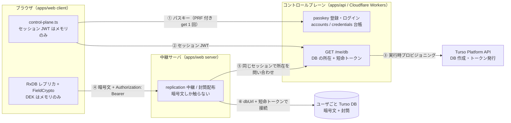

# マルチユーザ構成（コントロールプレーン + DB-per-user）

「スマホ単体で会員登録 → 自分の Turso DB に E2E で読み書き」を成立させる構成。設計の根拠は [RESEARCH.md §6 設計決定 3](RESEARCH.md#設計決定)（Identity 抽象・DB-per-user）と §7（コントロールプレーン）。実装は issue #99〜#105。

**既定は単一ユーザ self-host のまま**で、`ZAKKI_CONTROL_PLANE_URL` を設定したときだけこの構成になる（未設定なら従来どおり LocalIdentity で 1 つの DB を開く）。

## 全体図



### どこに何が無いか（E2E の境界）

| 場所                       | あるもの                                             | **無いもの**                     |
| -------------------------- | ---------------------------------------------------- | -------------------------------- |
| コントロールプレーン       | account / credential（公開鍵）・DB の所在            | DEK・PRF 出力・封筒・本文        |
| 中継サーバ（apps/web）     | 暗号文 wire doc・封筒（KEK 無しでは開けない）        | DEK・PRF 出力・平文              |
| ユーザごと Turso DB        | 暗号文・wrapped DEK（封筒）                          | 平文・KEK                        |
| ブラウザ                   | DEK（メモリのみ）・セッション JWT（メモリのみ）      | 永続化された鍵・トークン         |

- PRF 出力は **認証器 → ブラウザ**の中で閉じる。ログインの assertion に付く `clientExtensionResults` はそもそも送らないし、サーバも読まない（`apps/api/src/routes/auth.ts`）。
- `GET /me/db` が返すトークンは「その DB を開ける権限」であって復号鍵ではない。全部の鍵を失えば復号不能になる（真の E2E のトレードオフ。リカバリコード封筒が必須）。

## 構成要素

| 役割                | 実体                                                                              |
| ------------------- | --------------------------------------------------------------------------------- |
| Identity 抽象       | [`packages/core/src/identity/types.ts`](../packages/core/src/identity/types.ts)   |
| LocalIdentity       | [`packages/data/src/identity/local.ts`](../packages/data/src/identity/local.ts)（env / `identity.json`） |
| RemoteIdentity      | [`packages/core/src/identity/remote.ts`](../packages/core/src/identity/remote.ts)（`/me/db` の応答 → Identity） |
| コントロールプレーンクライアント | [`apps/web/src/client/api/control-plane.ts`](../apps/web/src/client/api/control-plane.ts) |
| 中継先の解決        | [`apps/web/src/server/identity/remote.ts`](../apps/web/src/server/identity/remote.ts) |

### 構成の選択は設定ベース

1. ブラウザは起動時に `GET /api/config` を叩く（中継サーバが自分の設定から `controlPlaneUrl` を返す）。
2. `null` なら従来経路（LocalIdentity 相当。認証なしで自分の 1 つの DB を読む）。
3. 値があればパスキーでログインし、`GET /me/db` の応答を `RemoteIdentity` に写す。ログインできない（未登録・キャンセル・WebAuthn 非対応）ときは `null` に畳んでローカルのみで起動する。

### 接続先の切替は「中継の維持」を選んだ

ブラウザから Turso HTTP を直叩きする案もあるが、replication のプロトコル（`POST /api/replication/:collection/pull|push`）・封筒配布・conflict 処理をすべて libSQL 直叩きに書き換えることになる。**変更が小さいのは現行の中継を残す方**なので、ブラウザ → apps/web → ユーザ DB の形を維持し、切り替わるのは中継先だけにした（direct 接続は将来 issue）。

中継サーバへ渡すのは **セッション JWT だけ**で、DB の URL やトークンは渡さない。宛先はサーバがコントロールプレーンに問い合わせて決める（クライアントの申告した URL へ接続する設計にすると、任意の宛先へ繋がせる穴になる）。

## 設定

| 環境変数                  | 効果                                                                   |
| ------------------------- | ---------------------------------------------------------------------- |
| `ZAKKI_CONTROL_PLANE_URL` | 中継サーバをマルチユーザ構成にする（apps/api の base URL）。未設定なら単一ユーザ |

コントロールプレーン側（`apps/api`）の設定は [`apps/api/src/env.ts`](../apps/api/src/env.ts) を参照（RP ID / origin・セッション鍵・Turso Platform API のトークンと group）。

## 未デプロイ前提の検証手順

クラウド（Cloudflare Workers / Turso）に上げなくても、**この構成のコード経路はローカルで全部通せる**。

### 1. 自動テスト（推奨・実物同士を繋ぐ）

```sh
bun test apps/web/src/client/api/control-plane.test.ts
```

実物の `apps/api`（passkey 認証・プロビジョニング）と実物の `apps/web`（中継）をプロセス内で繋ぎ、登録 → ログイン → `/me/db` → RemoteIdentity → 自分の DB へ E2E 読み書き、までを通す。ローカルで再現できない依存だけを**プロトコルレベル**で差し替える:

- Turso Platform API → fake（`apps/api/src/turso/test-fixtures.ts`。実 API と同じ経路・JSON）
- 認証器 → WebCrypto ソフトウェア認証器（`apps/api/src/auth/test-fixtures.ts`）に PRF を足したもの
- ユーザごとの Turso DB → 中継サーバが DB を開くアダプタにローカル libSQL を注入

同時に「PRF 出力・DEK・平文がどのサーバの wire にも現れないこと」「セッションが永続ストレージへ書かれないこと」も検証している。

### 2. 手で動かす（ローカル 2 プロセス）

実ブラウザ・実認証器で触りたい場合。Turso の実アカウントが要る（無料枠で足りる）ので、**プロビジョニングまで含めた通し確認はクラウド接続が前提**になる点に注意。

```sh
# 1) コントロールプレーン（apps/api）をローカルで起動
#    RP ID / origin は Web UI を開くオリジンに合わせる（WebAuthn は完全一致で検証する）
bun apps/api/src/index.ts   # wrangler dev でも可

# 2) 中継サーバをマルチユーザ構成で起動
ZAKKI_CONTROL_PLANE_URL=http://localhost:8787 just web
```

- WebAuthn はセキュアコンテキストを要求するため、ブラウザは `http://localhost:3777` で開く（`127.0.0.1` ではない）。
- コントロールプレーンを別ポート・別ホストで動かす場合、ブラウザからのクロスオリジン fetch には CORS 許可が要る（`apps/api` は現在 CORS ヘッダを出さないので、同一オリジン配下に置くかリバースプロキシで束ねる。issue #112）。なお **CSP 側は `ZAKKI_CONTROL_PLANE_URL` のオリジンを `connect-src` に自動で足す**ので、別オリジンでも CSP では塞がれない。
- ログイン UI はまだ無い（`resolveRemoteSession` が起動時に自動でログインを試みる）。会員登録の UI 導線は別 issue。

## 現時点の制約（将来 issue）

- ブラウザ → Turso 直接接続（中継サーバを介さない）は未実装。
- 会員登録・ログインの UI 導線が無い（未登録の状態ではローカルのみで起動する）。
- 中継サーバのユーザ DB ハンドルはセッション単位のキャッシュで、失効まで保持する。多人数運用では上限・退避の設計が要る。**退避を入れるときは `openRemoteDb` の戻り値も見直しが要る**（現在は libsql の client を返さないので、開いたハンドルを閉じる手段が無い）。
- **中継が通る実効的な窓は「セッション JWT の有効期限（12 時間）」ではなく「+ 最大 60 分」**。キャッシュ項目の失効は DB トークン基準（60 分）で、ヒット時はコントロールプレーンに問い合わせないため、JWT が期限切れになってもキャッシュが切れるまでは中継が通る。アカウントを跨ぐことは無い（キャッシュキーが JWT そのもの）。ステートレス JWT に失効機構が無い前提（#100）との整合。
- `apps/api` の CORS 設定が無い（同一オリジン配下での運用を前提にしている。issue #112）。
