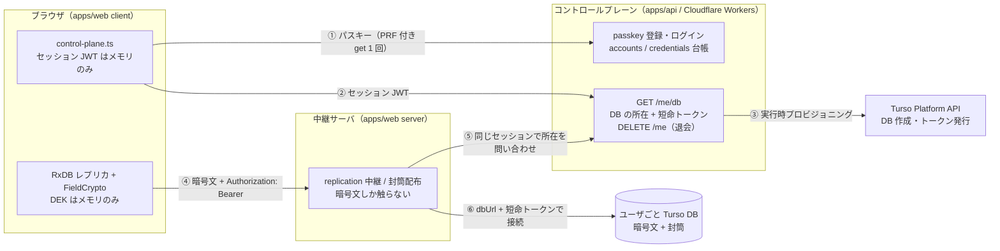

# マルチユーザ構成（コントロールプレーン + DB-per-user）

「スマホ単体で会員登録 → 自分の Turso DB に E2E で読み書き」を成立させる構成。設計の根拠は [RESEARCH.md §6 設計決定 3](RESEARCH.md#設計決定)（Identity 抽象・DB-per-user）と §7（コントロールプレーン）。実装は issue #99〜#105。

**既定は単一ユーザ self-host のまま**で、`ZAKKI_CONTROL_PLANE_URL` を設定したときだけこの構成になる（未設定なら従来どおり LocalIdentity で 1 つの DB を開く）。

## 全体図



### どこに何が無いか（E2E の境界）

| 場所                   | あるもの                                        | **無いもの**              |
| ---------------------- | ----------------------------------------------- | ------------------------- |
| コントロールプレーン   | account / credential（公開鍵）・DB の所在       | DEK・PRF 出力・封筒・本文 |
| 中継サーバ（apps/web） | 暗号文 wire doc・封筒（KEK 無しでは開けない）   | DEK・PRF 出力・平文       |
| ユーザごと Turso DB    | 暗号文・wrapped DEK（封筒）                     | 平文・KEK                 |
| ブラウザ               | DEK（メモリのみ）・セッション JWT（メモリのみ） | 永続化された鍵・トークン  |

- PRF 出力は **認証器 → ブラウザ**の中で閉じる。ログインの assertion に付く `clientExtensionResults` はそもそも送らないし、サーバも読まない（`apps/api/src/routes/auth.ts`）。
- `GET /me/db` が返すトークンは「その DB を開ける権限」であって復号鍵ではない。全部の鍵を失えば復号不能になる（真の E2E のトレードオフ。リカバリコード封筒が必須）。

## 構成要素

| 役割                             | 実体                                                                                                            |
| -------------------------------- | --------------------------------------------------------------------------------------------------------------- |
| Identity 抽象                    | [`packages/core/src/identity/types.ts`](../packages/core/src/identity/types.ts)                                 |
| LocalIdentity                    | [`packages/data/src/identity/local.ts`](../packages/data/src/identity/local.ts)（env / `identity.json`）        |
| RemoteIdentity                   | [`packages/core/src/identity/remote.ts`](../packages/core/src/identity/remote.ts)（`/me/db` の応答 → Identity） |
| コントロールプレーンクライアント | [`apps/web/src/client/api/control-plane.ts`](../apps/web/src/client/api/control-plane.ts)                       |
| 中継先の解決                     | [`apps/web/src/server/identity/remote.ts`](../apps/web/src/server/identity/remote.ts)                           |

### 構成の選択は設定ベース

1. ブラウザは起動時に `GET /api/config` を叩く（中継サーバが自分の設定から `controlPlaneUrl` を返す）。
2. `null` なら従来経路（LocalIdentity 相当。認証なしで自分の 1 つの DB を読む）。
3. 値があればパスキーでログインし、`GET /me/db` の応答を `RemoteIdentity` に写す。ログインできない（未登録・キャンセル・WebAuthn 非対応）ときは `null` に畳んでローカルのみで起動する。

### パスキーの追加・失効（機種変更, issue #115）

登録経路（`POST /auth/register/options`）は毎回新しい accountId を採番するので、2 台目の端末でそれを使うと**別アカウントが生える**。既存アカウントに鍵を足すのは要セッションの別経路にした。

| エンドポイント                           | 役割                                                                       |
| ---------------------------------------- | -------------------------------------------------------------------------- |
| `POST /auth/credentials/options`         | 既存 accountId を `userID` にした登録 options（`excludeCredentials` 付き） |
| `POST /auth/credentials/verify`          | attestation 検証 → `credentials` に 1 行追加（`accounts` は作らない）      |
| `GET /auth/credentials`                  | 一覧（credentialId・表示名・作成日時。公開鍵は返さない）                   |
| `DELETE /auth/credentials/:credentialId` | 失効。**最後の 1 本は 409**（アカウントに入れなくなるため）                |

- 新端末はまだログインできないので、**ログイン済み端末で ceremony を行い WebAuthn の cross-device authentication（hybrid transport）で新端末の認証器を使う**のが主導線。そのため `authenticatorSelection` に `authenticatorAttachment` を指定しない（指定すると platform / cross-platform のどちらかに絞られ hybrid が落ちる）。
- challenge の `kind` は `"credential"` で、新規登録の `"registration"` と分けてある。同じにすると追加用 challenge を `register/verify` へ流し込めてしまう。
- **PRF 出力はクレデンシャルごとに異なる**ため、DEK 封筒もクレデンシャルごとに 1 本持つ（issue #120。`key_envelopes` は代理キー + 部分ユニークインデックスで「3 種は単数・passkey は鍵ごと」を表す）。追加したパスキーで封筒を作れば、そのパスキー単独でログインもアンロックもできる。

#### 失効はクライアントが 2 段階で行う（issue #120）

**クレデンシャルと封筒は別の DB にある。** クレデンシャル（公開鍵）はコントロールプレーン DB、封筒はユーザ自身のジャーナル DB で、サーバは互いの DB を触らない。したがって失効は 1 つの API では完結せず、クライアントが順に呼ぶ。

| 順  | 呼ぶもの                                                         | 消えるもの                     |
| --- | ---------------------------------------------------------------- | ------------------------------ |
| 1   | `DELETE /auth/credentials/:credentialId`（コントロールプレーン） | パスキー（ログイン・PRF 評価） |
| 2   | `DELETE /api/crypto/envelopes/passkey/:credentialId`（中継）     | そのパスキーの DEK 封筒        |

順序はこの通り（先に封筒だけ消すとアンロック手段を失う）。片方だけ成功しても致命的ではない: クレデンシャルを失効させれば PRF を評価できないので、残った封筒を開く経路が無い。2 段目は冪等（未知の credentialId でも 200）なので、やり直しは安全。

逆向きの取りこぼし（クレデンシャルはあるが封筒が無い）は、クライアントが**自己修復**する: ログインの `get()` で評価済みの PRF があり、その credentialId の封筒が無ければ、パスフレーズ等で DEK が得られた直後に封筒を作る（`apps/web/src/client/db/bootstrap.ts`）。

なお **コントロールプレーンを使わない単一ユーザ self-host 構成でも複数パスキーは効く**。パスキーは DEK アンロック専用になり、封筒の登録（`POST /api/crypto/envelopes/passkey`）だけで「スマホとノート PC の両方で開ける」が成立する。

### パスキーの表示名（issue #118）

`user.name` は「どのアカウントか」を見分ける識別子（`<accountId 先頭 8 文字>@<RP ID>`。同じアカウントのクレデンシャルでは常に一致する）、`user.displayName` は人間向けの名札（`label` 未指定なら `zakki (YYYY-MM-DD)`）。同じ値を入れない。options 発行時に決めた `displayName` は challenge 行に持ち、verify が通ったら `credentials.display_name` へ写す（OS の選択 UI に出る名前と一覧 API が返す名前を一致させるため）。

### 接続先の切替は「中継の維持」を選んだ

ブラウザから Turso HTTP を直叩きする案もあるが、replication のプロトコル（`POST /api/replication/:collection/pull|push`）・封筒配布・conflict 処理をすべて libSQL 直叩きに書き換えることになる。**変更が小さいのは現行の中継を残す方**なので、ブラウザ → apps/web → ユーザ DB の形を維持し、切り替わるのは中継先だけにした（direct 接続は将来 issue）。

中継サーバへ渡すのは **セッション JWT だけ**で、DB の URL やトークンは渡さない。宛先はサーバがコントロールプレーンに問い合わせて決める（クライアントの申告した URL へ接続する設計にすると、任意の宛先へ繋がせる穴になる）。

### 退会（`DELETE /me`）

会員登録の逆操作（issue #116）。対象は常にセッションの持ち主自身で、相手を指定する引数は無い。

1. 台帳（`account_databases`）から DB 名を引く。行が無ければ `accountId` から決定的に導く（プロビジョニングが「DB 作成 → 台帳書き込み」の順なので、台帳に載っていない DB が実在しうる）
2. Turso Platform API で DB を削除する（`DELETE /v1/organizations/{org}/databases/{db}`。404 は「既に無い」として成功に畳む）
3. `accounts` の行を削除する。`credentials` / `account_databases` は cascade で消える

**順序は「DB 削除 → 台帳削除」で固定**。逆順にすると台帳を消した時点で DB 名の出どころが失われ、誰も参照しない・誰も消せない孤児 DB が Turso に残る。DB 削除に失敗したら台帳を残したまま 502 を返す——この状態は「まだ退会していない」だけなので、同じリクエストの再送で続きから完了できる。

退会後もセッション JWT は署名としては最長 12 時間有効なままなので、`requireSession` の直後に台帳を引いて**そのセッションが今も生きているか**を確かめる（`requireActiveSession`。次節）。これが無いと退会直後の `GET /me/db` を `ensureUserDatabase` が「初回」と解釈し、消したはずの DB を作り直してしまう。

### ログアウト・セッション失効（issue #117）

セッションはステートレス JWT（HS256, TTL 12 時間）なので、そのままでは「発行済みトークンを止める」手段が無い。**セッション世代（epoch）** でそれを補う。

| 要素 | 実体                                                                                     |
| ---- | ---------------------------------------------------------------------------------------- |
| 台帳 | `accounts.session_epoch`（integer, 既定 0）                                              |
| 発行 | `issueSession` が発行時点の世代を `epoch` claim としてトークンに焼く                     |
| 検証 | `requireActiveSession` が JWT の `epoch` と台帳の現在値を突き合わせ、不一致なら 401      |
| 失効 | `POST /auth/logout`（要セッション）が `session_epoch = session_epoch + 1` の 1 文を実行 |

失効させると、そのアカウントが過去に発行したトークンが全て一斉に「古い世代」になる（＝全端末ログアウト）。

- **セッションテーブルを持たない**のが要点。トークン 1 本ごとの行を書くとログインのたびに書き込みが増え、掃除も要る。世代番号ならアカウント 1 行の整数で「全部無効」を表現できる。
- **アカウント存在確認（#116）と世代照合は同じ 1 行**なので、`requireActiveSession` が 1 クエリで両方見る（`requireLiveAccount` を置き換えた。適用先は `/auth/me`・`/auth/credentials{,/*}`・`/me/db`・`DELETE /me` で変わらない）。
- 世代の加算は **SQL 側の `+ 1`**。現在値を読んでから書くと、2 台から同時にログアウトしたとき双方が同じ値を書いて世代が 1 つしか進まない（先に発行されたトークンが生き残る）。
- `epoch` claim の**欠落は 401**。「無ければ 0 とみなす」にすると claim を落とすだけで失効を回避できてしまう。
- ログアウトはアカウントもパスキーもデータも消さない。**再ログインすれば新しい世代のトークンが出て、同じ DB に戻れる**（退会 `DELETE /me` とは別物）。

> [!IMPORTANT]
> **この機能を含むデプロイ時の手順**（既存デプロイがある場合のみ）
>
> 1. **migration 0003 を新コードより先に当てる**。逆順だと `requireActiveSession` が存在しない `session_epoch` を引いて全リクエストが失敗する。
> 2. **既存の発行済みトークンは全ユーザ分が 401 になる**（`epoch` claim を持たないため）。障害ではなく設計どおりで、利用者は再ログインすれば復帰できる。

#### 「この端末だけログアウト」を持たない理由

epoch は**アカウント単位の 1 整数**なので、端末ごとの失効は表現できない（+1 すれば全端末が落ちる）。端末単位を表現するにはトークン 1 本ごとの状態が要り、ステートレスなセッション設計そのものを覆すことになる。

一方で実際に必要な「あの端末を切りたい」は**パスキー単位の失効**（`DELETE /auth/credentials/:credentialId`, #115）で表現できる——端末とパスキーは 1 対 1 に対応し、鍵を消せばその端末は二度とログインできない。残るのは「消した瞬間に生きていたトークン」（最長 12 時間）だけで、それは全端末ログアウトを併用すれば止まる。2 つの合成で目的が満たせるので、端末単位の失効機構は持たない。

#### 実効的な失効遅延

| 経路                                                                          | 失効までの遅延                                          |
| ----------------------------------------------------------------------------- | ------------------------------------------------------- |
| コントロールプレーン（`/auth/me`・`/me/db`・`/auth/credentials`・`DELETE /me`） | **即時**（次のリクエストから 401）                     |
| 中継サーバ経由（`/api/replication/*`・`/api/crypto/envelopes`）                | **最大 60 秒**                                          |
| ブラウザが握ったままの DB トークン（Turso 直叩き）                            | 最大 60 分（`GET /me/db` の TTL。失効させる手段が無い） |

中継サーバのキャッシュ（`apps/web/src/server/identity/remote.ts`）はセッション JWT 単位で、ヒット時はコントロールプレーンへ問い合わせない。ここで取り得た選択肢は 3 つ:

1. **キャッシュ TTL を短くする（例 5 分）** — 失効窓は縮むが、切れるたびにユーザ DB ハンドルを開き直す。ハンドルを閉じる手段が無い（`openRemoteDb` は client を返さない）ので、開きっぱなしが 12 倍に増える。
2. **ヒット時も毎回 `/auth/me` を叩く** — 確実だが、replication は 1 操作ごとに pull / push が飛ぶので往復が常時 2 倍になる。
3. **ヒット時も `/auth/me` で検証し、検証結果を 60 秒メモ化する**（採用） — 失効遅延は 60 秒で頭打ち、追加の往復はセッションあたり 60 秒に 1 回、DB ハンドルは従来どおり DB トークンの寿命に 1 つ。

3 を選んだのは 1 と 2 の代償だけを避けられるため。再検証で **401 / 403** を受けた項目はキャッシュごと捨て、DB ハンドルは（接続先も DB トークンの寿命も変わらないので）開き直さない。並列リクエストの再検証は 1 本に束ねる。

失効とみなすのは「このセッションは無効だ」と明示された 401 / 403 だけで、**上流の一時障害（5xx・応答不正・ネットワーク断）ではキャッシュを捨てない**。捨てるとその場が 401 に見えるうえ、復旧後の再解決で閉じられない DB ハンドルが増える（案 1 を退けた理由と同じ）。検証済み時刻を進めないので、次のリクエストで再試行する。この間の上限は DB トークンの寿命（最大 60 分）が担う。

## 設定

| 環境変数                  | 効果                                                                             |
| ------------------------- | -------------------------------------------------------------------------------- |
| `ZAKKI_CONTROL_PLANE_URL` | 中継サーバをマルチユーザ構成にする（apps/api の base URL）。未設定なら単一ユーザ |

コントロールプレーン側（`apps/api`）の設定は [`apps/api/src/env.ts`](../apps/api/src/env.ts) を参照（RP ID / origin・セッション鍵・Turso Platform API のトークンと group）。

## 未デプロイ前提の検証手順

クラウド（Cloudflare Workers / Turso）に上げなくても、**この構成のコード経路はローカルで全部通せる**。

### 1. 自動テスト（推奨・実物同士を繋ぐ）

```sh
bun test apps/web/src/client/api/control-plane.test.ts
```

実物の `apps/api`（passkey 認証・プロビジョニング）と実物の `apps/web`（中継）をプロセス内で繋ぎ、登録 → ログイン → `/me/db` → RemoteIdentity → 自分の DB へ E2E 読み書き、までを通す。ローカルで再現できない依存だけを**プロトコルレベル**で差し替える:

- Turso Platform API → fake（`apps/api/src/turso/test-fixtures.ts`。実 API と同じ経路・JSON）
- 認証器 → WebCrypto ソフトウェア認証器（`apps/api/src/auth/test-fixtures.ts`）に PRF を足したもの
- ユーザごとの Turso DB → 中継サーバが DB を開くアダプタにローカル libSQL を注入

同時に「PRF 出力・DEK・平文がどのサーバの wire にも現れないこと」「セッションが永続ストレージへ書かれないこと」も検証している。

### 2. 手で動かす（ローカル 2 プロセス）

実ブラウザ・実認証器で触りたい場合。Turso の実アカウントが要る（無料枠で足りる）ので、**プロビジョニングまで含めた通し確認はクラウド接続が前提**になる点に注意。

```sh
# 1) コントロールプレーン（apps/api）をローカルで起動
#    RP ID / origin は Web UI を開くオリジンに合わせる（WebAuthn は完全一致で検証する）
bun apps/api/src/index.ts   # wrangler dev でも可

# 2) 中継サーバをマルチユーザ構成で起動
ZAKKI_CONTROL_PLANE_URL=http://localhost:8787 just web
```

- WebAuthn はセキュアコンテキストを要求するため、ブラウザは `http://localhost:3777` で開く（`127.0.0.1` ではない）。
- コントロールプレーンを別ポート・別ホストで動かす場合、ブラウザからのクロスオリジン fetch には CORS 許可が要る（`apps/api` は現在 CORS ヘッダを出さないので、同一オリジン配下に置くかリバースプロキシで束ねる。issue #112）。なお **CSP 側は `ZAKKI_CONTROL_PLANE_URL` のオリジンを `connect-src` に自動で足す**ので、別オリジンでも CSP では塞がれない。
- ログイン UI はまだ無い（`resolveRemoteSession` が起動時に自動でログインを試みる）。会員登録の UI 導線は別 issue。

## 現時点の制約（将来 issue）

- ブラウザ → Turso 直接接続（中継サーバを介さない）は未実装。
- 会員登録・ログインの UI 導線が無い（未登録の状態ではローカルのみで起動する）。
- 中継サーバのユーザ DB ハンドルはセッション単位のキャッシュで、失効まで保持する。多人数運用では上限・退避の設計が要る。**退避を入れるときは `openRemoteDb` の戻り値も見直しが要る**（現在は libsql の client を返さないので、開いたハンドルを閉じる手段が無い）。
- **中継が通る実効的な窓は「セッション JWT の有効期限（12 時間）」+ 最大 60 秒**（[実効的な失効遅延](#実効的な失効遅延)）。ログアウト・退会・期限切れのいずれも、中継サーバが 60 秒ごとに `/auth/me` で再検証するところで止まる。アカウントを跨ぐことは無い（キャッシュキーが JWT そのもの）。
- `apps/api` の CORS 設定が無い（同一オリジン配下での運用を前提にしている。issue #112）。
- **`GET /me/db` が返した DB トークン（TTL 60 分）そのものは失効させられない**。ログアウト・退会の後も、その値を握ったクライアントは最長 60 分 Turso を直叩きできる（退会の場合は DB 自体が消えているので読めるものは無い）。Turso のトークンは発行時点で自己完結しているため、止めるには DB ごと作り直すか TTL を短くするしかない。
- ログアウト・退会の UI 導線が無い（`POST /auth/logout` / `DELETE /me` を直接叩く）。
