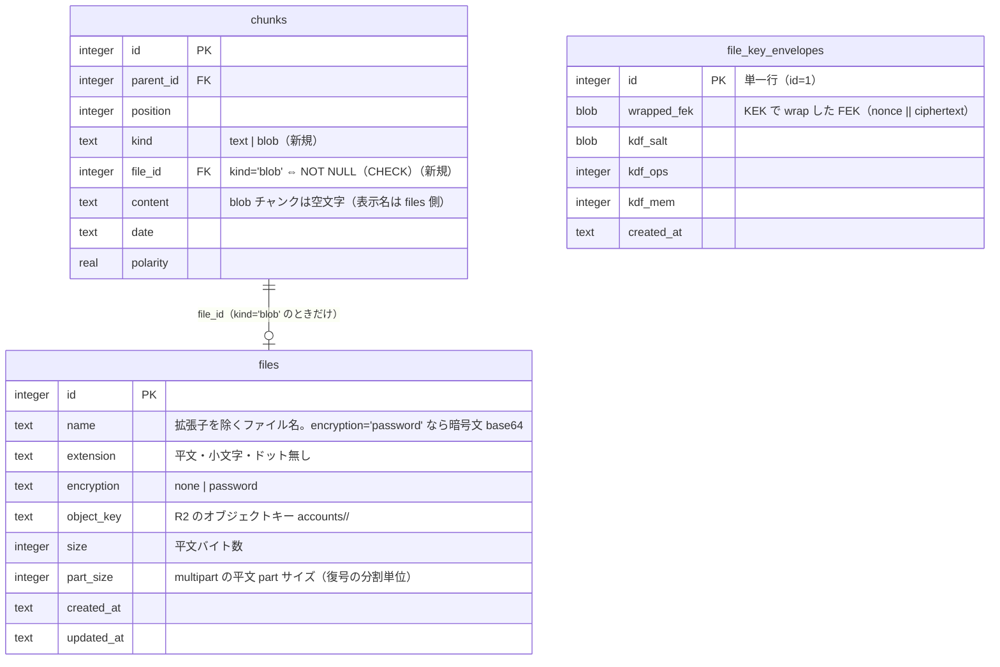
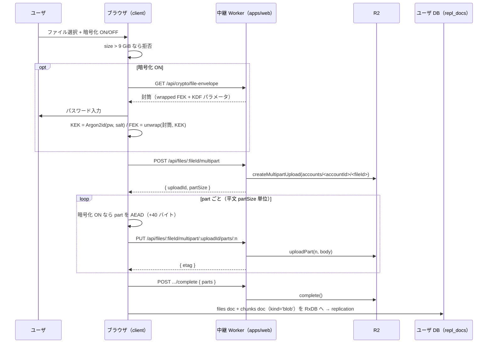
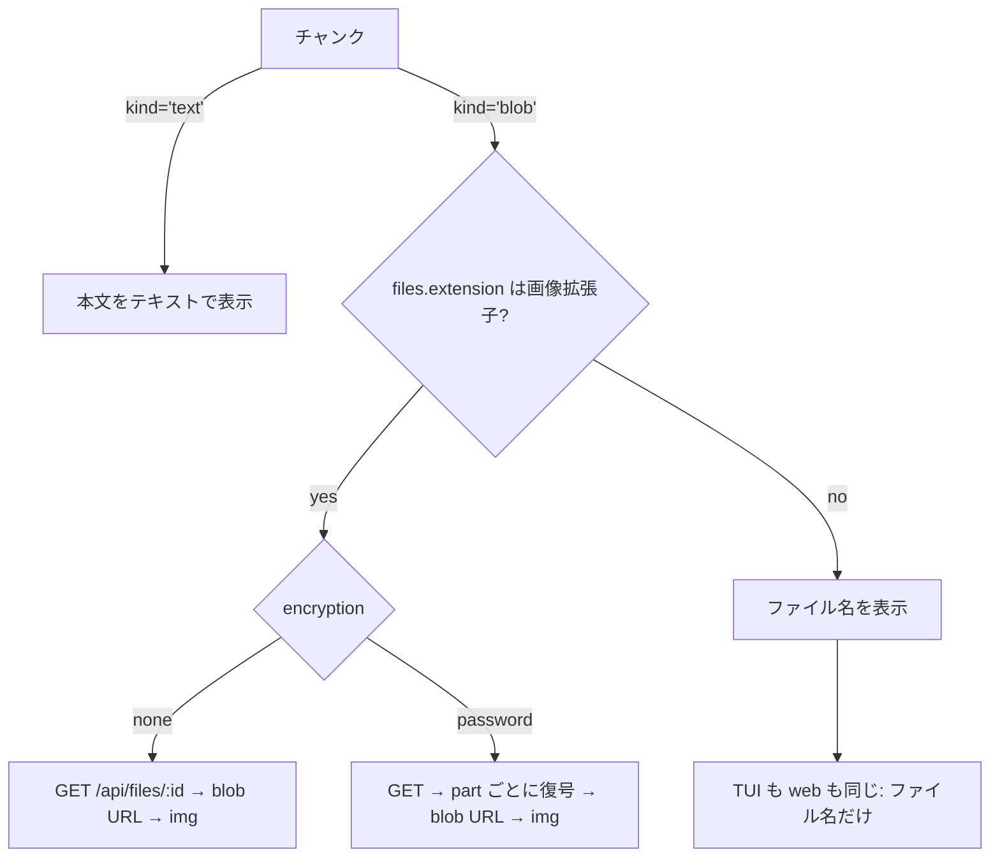

# ファイルアップロード（issue #157）

アップロードしたファイルを 1 チャンクとして日記に並べる。画像は画像として、
それ以外はファイル名として表示する。

## 決定（issue の残論点・未定事項への回答）

| 論点                       | 決定                                                                                                                                                     | 理由                                                                                                                                                                                                                                                                                         |
| -------------------------- | -------------------------------------------------------------------------------------------------------------------------------------------------------- | -------------------------------------------------------------------------------------------------------------------------------------------------------------------------------------------------------------------------------------------------------------------------------------------- |
| アップロード経路           | **Worker 経由の multipart**（R2 binding の `createMultipartUpload` / `uploadPart`）                                                                      | 1 part を Workers のボディ上限（Free/Pro 100 MB）内に収めれば 9 GiB でも通る。S3 アクセスキーもバケット CORS も要らず、認証は既存の中継 Worker（`CONTROL_PLANE` binding → `/auth/me`）の延長でそのまま効く                                                                                   |
| パスワード変更（残論点 1） | **封筒方式で鍵を間接化**。パスワード → KEK（Argon2id）、ファイル暗号鍵 FEK は封筒で wrap して保存。変更は封筒の再 wrap のみで、R2 上のファイルは触らない | 既存の `key_envelopes`（DEK + 封筒）と同じ設計。9 GiB 級の再暗号化が原理的に発生しない                                                                                                                                                                                                       |
| チャンク E2E 暗号との関係  | **独立**。ファイル暗号は `file_key_envelopes` / FEK を自前で持ち、チャンク暗号（既定 OFF, #133）の ON/OFF に依存しない                                   | issue §5 の「既存のチャンク E2E 暗号とは独立した仕組み」                                                                                                                                                                                                                                     |
| `files.extension`          | **平文**（`files.name` は暗号 ON なら暗号文）                                                                                                            | 画像かどうかの弁別に使う（issue §1）。`chunks.date` を平文にしているのと同じ受容（docs/CHUNKS.md §解析・E2E への影響）                                                                                                                                                                       |
| 上限                       | `MAX_UPLOAD_BYTES = 9 GiB`（9 × 1024³）                                                                                                                  | issue §4 の「9 GB」。クライアントで拒否し、サーバは 1 part のサイズ上限だけを見る                                                                                                                                                                                                            |
| blob チャンクの position   | **`BLOB_POSITION_BASE = 1_000_000` 以上の帯域**に置く（テキスト草稿は従来どおり 0 始まり）                                                               | `saveChildren`（テキスト草稿の投影）は「どの草稿にも対応しない既存行を消す」ので、blob チャンクを同じ position 空間に置くとテキスト保存のたびに消える。帯を分ければ投影から外すだけで不変条件（`unique(parent_id, position)`）を壊さない。表示順は同じ親の中でテキスト行の後ろに並ぶ（受容） |

## データモデル

`chunks.file_id` は `files.id` を参照する（issue §2 の「blob チャンクはこのテーブルの
行を参照する」）。FK は cascade を持たない: チャンク削除時は **リポジトリが部分木の
file 行を集めてから** チャンク → file 行の順で消す（R2 オブジェクトキーが必要なため、
どのみち事前に読む必要がある）。

web クライアントは既存のチャンク同様 RxDB の `files` コレクションを持ち、
replication（`repl_docs`）で同期する。R2 のバイト列だけが replication の外を通る。

## アップロード

## 表示

TUI は blob チャンクを**常にファイル名だけ**表示する（画像も含む。issue §6）。
`encryption='password'` の行は TUI に FEK が無いので復号できず、
`暗号化ファイル.<ext>` のプレースホルダを出す。

## 要件チェックリスト

### A. スキーマ / data 層

- [x] A1. migration 適用後、既存チャンク行の `kind` は `'text'` になる
- [x] A2. `kind='blob'` かつ `file_id IS NULL` の INSERT は CHECK 制約で失敗する
- [x] A3. `kind='text'` かつ `file_id` 非 NULL の INSERT は CHECK 制約で失敗する
- [x] A4. `insertFile` が `files` 行を作り、`id` を返す
- [x] A5. `deleteChunk` が blob チャンクの部分木を消すとき、参照していた `files` 行も消える
- [x] A6. `deleteChunk` が削除した file 行の `objectKey` 一覧を返す（R2 掃除の材料）
- [x] A7. 暗号 ON の DB で `files.name` が AEAD で暗号化され、読み出しで復号される（AAD `file.name`）
- [x] A8. `saveChildren`（テキスト草稿の投影）は blob チャンクを消さない
- [x] A9. `listFilesByChunk` が chunk id → file 行の対応を返す（TUI 表示の材料）

### B. ファイル種別の弁別（core・純関数）

- [x] B1. `png` / `jpg` / `jpeg` / `gif` / `webp` / `avif` / `svg` / `bmp` / `ico` は画像と判定する
- [x] B2. `pdf` / `txt` / 空文字 は画像でないと判定する
- [x] B3. 判定は大文字小文字を無視する（`PNG` → 画像）
- [x] B4. `splitFilename("a.b.PNG")` が `{ name: "a.b", extension: "png" }` を返す
- [x] B5. 拡張子の無いファイル名は `extension: ""` になる
- [x] B6. blob チャンクの表示名は `name + "." + extension`（拡張子が空なら `name` のみ）
- [x] B7. `encryption='password'` の blob チャンクを FEK 無しで表示するとプレースホルダになる

### C. ファイル暗号（core・純関数）

- [x] C1. `wrapFek` / `unwrapFek` が同じパスワード・ソルトで往復する
- [x] C2. パスワードが違うと `unwrapFek` が throw する
- [x] C3. `rewrapFek` が新パスワードの封筒を返し、開くと **同じ FEK** が出る（既存ファイル不変）
- [x] C4. `encryptPart` → `decryptPart` が往復し、暗号文長 = 平文長 + 40（nonce 24 + tag 16）
- [x] C5. part 番号が違うと `decryptPart` が throw する（part の入れ替え・欠落を検出する）
- [x] C6. `MAX_UPLOAD_BYTES`（9 GiB）超は `validateUploadSize` が拒否する
- [x] C7. `ciphertextPartSize(partSize)` と `plaintextRanges` が平文/暗号文の境界を相互変換する

### D. R2 ルート（apps/web サーバ）

- [ ] D1. 未認証（Authorization 無し）の `POST /api/files/:id/multipart` は 401
- [ ] D2. `POST /api/files/:id/multipart` が `uploadId` と `partSize` を返す
- [ ] D3. `PUT .../parts/:n` が R2 へ part を書き、`etag` を返す
- [ ] D4. part サイズが上限（`MAX_PART_BYTES`）超なら 413
- [ ] D5. `POST .../complete` 後に `GET /api/files/:id` が元のバイト列を返す
- [ ] D6. `DELETE /api/files/:id` 後に `GET` が 404 になる
- [ ] D7. オブジェクトキーはアカウントごとに分離される（別アカウントの同じ fileId は別オブジェクト）
- [ ] D8. R2 binding が無い配備では `/api/files/*` が 503 を返す（単一ユーザ self-host）

### E. FEK 封筒ルート

封筒は既存のチャンク封筒（`/api/crypto/envelopes`）と同じ `crypto` ルート配下に置く。
`/api/files/:fileId` と同じ階層に置くと `:fileId` にマッチして経路順序に依存するため。

- [ ] E1. `GET /api/crypto/file-envelope` は封筒が無ければ `{ envelope: null }`
- [ ] E2. `PUT /api/crypto/file-envelope` で保存した封筒が `GET` で返る
- [ ] E3. `PUT` の `wrappedFek` が封筒の長さ（72 バイト）でなければ 400
- [ ] E4. 未認証の `GET` / `PUT` は 401

### F. web クライアント統合

- [ ] F1. `uploadFile` が multipart を分割して全 part を送り、complete まで呼ぶ
- [ ] F2. `uploadFile` が完了後に `files` doc と `kind='blob'` の chunk doc を RxDB へ入れる
- [ ] F3. 暗号化 ON のとき、Worker へ送られる part は平文と一致しない（暗号文である）
- [ ] F4. blob チャンクの削除で `DELETE /api/files/:id` が呼ばれる
- [ ] F5. `filePush` / `filePull`（replication modifier）が `name` を暗号化・復号して往復する
- [ ] F6. `saveChildrenDocs`（web の投影）は blob チャンク doc を消さない
- [ ] F7. `setFilePassword` → `unlockFek` が往復する（封筒はサーバ、FEK はメモリのみ）
- [ ] F8. `changeFilePassword` の後、新パスワードで同じ FEK が開く（既存ファイル不変）
- [ ] F9. パスワード違いの `unlockFek` は null を返す（例外を UI へ漏らさない）

### G. TUI

- [x] G1. blob チャンクは `files` のファイル名で表示される（`content` ではなく）
- [x] G2. `encryption='password'` の blob チャンクはプレースホルダで表示される
- [x] G3. blob チャンクは編集バッファ（raw 再構成）から外れる（打ち直しで二重化しない）

### H. インフラ / 配備

- [x] H1. `apps/web/wrangler.jsonc` に R2 binding（`FILES`）がある
- [x] H2. R2 バケットを Pulumi（`infra/`）で宣言する
- [ ] H3. CSP の `img-src` に `blob:` が入る（復号した画像を `` で出すため）
- [ ] H4. ユーザ設定画面（ファイルパスワードの設定・変更）が左サイドバーから開ける
- [ ] H5. 右パネル・グラフで blob チャンクが画像／ファイル名として表示され、アップロード UI がある

## 非機能・受容

- **9 GiB の実アップロードは検証しない**（CI でも手元でも現実的でない）。part 分割・
  暗号化・complete の各段は単体テストで縛り、サイズ上限は純関数で縛る。
- **Range リクエストは実装しない**。画像の表示はフル取得 → blob URL。大きな非画像
  ファイルはダウンロード（`<a download>`）のみで、部分取得は将来の課題。
- **孤児オブジェクトの GC は実装しない**。削除はチャンク削除時の明示 DELETE のみ。
  アップロード途中で中断した multipart は R2 の abort を呼ばずに残りうる（受容）。
- `files.extension` / `files.size` / オブジェクトキーはサーバから見えるメタデータ
  （暗号 ON でも隠さない）。`chunks.date` が平文である方針と揃える。
