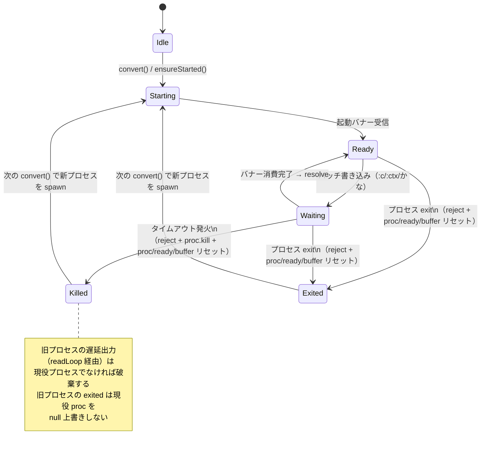

# issue #85: AncoEngine タイムアウト時のプロセス再起動とバッファクリア

対象: `packages/backend/src/anco/engine.ts` の `AncoEngine`。

## 問題

1. タイムアウト経路（`waitForBanners` の setTimeout）が pending を reject するだけで anco プロセスを生かしたままにする。遅延した旧応答のバナー/候補行を次リクエストが消費し、ストリームの対応がずれる。
2. プロセスが行の途中で死んだ場合に `this.buffer` がリセットされず、次プロセスの先頭出力（バナー行）に残渣が連結され、以後の応答区切りが壊れる。

## 求める振る舞い

## テスト可能なアサーション

- [x] タイムアウト発生時、pending の convert はエラーで reject され、旧プロセスが kill される
- [x] タイムアウト後の次の convert で新プロセスが spawn され、正常に候補を返す
- [x] タイムアウト後に旧プロセスの遅延応答（バナー+候補行）が届いても、次リクエストの応答と混線しない（新プロセスの応答だけを返す）
- [x] プロセスが行の途中（改行なし出力後）で exit した後の再起動で、旧バッファ残渣が次の応答に混入しない
- [x] kill 後に旧プロセスの exited が遅延発火しても、新プロセスの proc/ready を null 上書きしない（新プロセスでの変換が成功し、追加の spawn も発生しない）

## 実装判断（確定事項）

- タイムアウト値はコンストラクタ第4引数 `timeoutMs`（既定 `REQUEST_TIMEOUT_MS`）として注入可能にする。
  Bun 1.3.12 の fake timer（`jest.useFakeTimers` + `advanceTimersByTime`）は動作するが、
  既存テストの実タイマー依存（`waitFor` ポーリング・fake stdout の notify）と干渉するため採用しない。
- 「異常応答検出時（候補ゼロ throw）の kill」は入れない。候補ゼロはバナーまで正しく受信し
  フレーミングが完結した後の内容判定であり、ストリームずれは発生しないため（目的に照らして kill 不要）。
