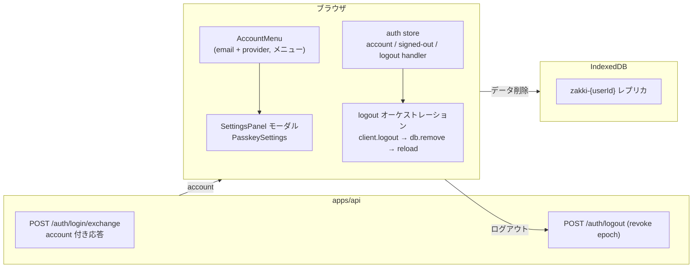

# issue #159: サイドバー下部のアカウント表示・ログアウト・設定

ログイン中（signed-in）のとき、サイドバー下部に**メールアドレスと OIDC プロバイダ名**
を表示し、クリックで開くメニューから**ログアウト**と**設定**を選べるようにする。
区分の前提（`#117` サーバ側 / `#158` ログイン時マージ）は別管理。

## 仕様（決定事項）

- **表示する値はメールアドレス**。内部の `accountId` は表示しない
- 複数 identity があるときは **主アカウント**（`account_identities.is_primary` + 部分一意
  インデックス）の email / provider を出す。主が 0 件のときは**最も古い作成**の identity を主とみなす
- **ログアウト**: `POST /auth/logout`（全端末ログアウト, #117）→ メモリ上のセッションを
  捨てる → ブラウザ内のデータ（IndexedDB `zakki-{userId}`）を消す → ページをリロードして
  起動時の `resolveRemoteSession` が signed-out を出す
- **設定**: モーダルオーバーレイで開く。パスキー設定（`PasskeySettings`）はここへ移す。
  未ログイン（signed-out / 単一ユーザ self-host）でも ⚙ 設定ボタンから開ける
- 表示・メニューは**サイドバー展開時のみ**

## アカウント情報の供給（設計）

- `POST /auth/login/exchange` の応答に `account: { email, provider: { id, name } }` を追加。
  セッション JWT はメモリのみ（リロードで必ず signed-out）なので、ログイン時の 1 回で足りる
- クライアントは `ControlPlaneSession.account` に受け、auth ストアへ映す。
  `GET /auth/me` は変更しない（中継サーバの役割のまま）

## フロー

## テスト可能なアサーション（1 項目 = 1 テスト）

### API（apps/api）

- [ ] R1: migration 適用後 `account_identities` に `is_primary`（not null, default 0）と
  部分一意インデックスが在る。同一 account へ `is_primary=1` を 2 行書くと衝突する
  （`src/db/schema.test.ts`）
- [ ] R2: 新規アカウントの最初の identity は `is_primary=1`（`src/routes/auth.test.ts`）
- [ ] R3: `POST /auth/login/exchange` 応答に `account`（主 identity の email と
  provider `{ id, name }`）が載る（`src/routes/auth.test.ts`）
- [ ] R4: 主 identity が無い（`is_primary=1` が無い）ときは最も古く作られた identity の
  email を主として返す（`src/auth/identities.test.ts`）
- [ ] R5: relink（`cli/relink-identity.ts`）で targets が既に主を持つ場合も部分一意インデックス
  違反にならず、主は高々 1 つに収まる（`cli/relink-identity.test.ts`）

### Web クライアント（apps/web/src/client）

- [ ] R6: `completeLogin` の結果（`ControlPlaneSession`）から email / provider（id, name）が
  取れる（`api/control-plane.test.ts`）
- [ ] R7: `ControlPlaneClient.logout()` は `POST /auth/logout` を Authorization 付きで呼び、
  204 後に `session()` が null になり `connect()` が 401 を投げる（`api/control-plane.test.ts`）
- [ ] R8: 未ログインの `logout()` は no-op（fetch を発行しない）（`api/control-plane.test.ts`）
- [ ] R9: `resolveRemoteSession` の signed-in 結果が account 情報を運ぶ
  （`api/control-plane.test.ts`）
- [ ] R10: auth store は `setSignedIn` で account を持ち、`logout` で登録済み handler を
  呼ぶ（`store/auth.test.ts`）
- [ ] R11: ログアウト オーケストレーション `logoutRemoteSession` は client.logout →
  db.remove → reload の順に実行する（`client/auth/logout.ts` + `logout.test.ts`）

### UI（agent-browser で E2E 確認 — 自動テストの対象外）

- [ ] U1: 展開時、signed-in のサイドバー下部に email + プロバイダ名が出る。折り畳み時は出ない
- [ ] U2: アカウント表示クリックでメニュー（ログアウト / 設定）が開く
- [ ] U3: ログアウト後 signed-out に戻り「Google でログイン」が出る
- [ ] U4: 設定からパスキー設定（モーダル）が開く。signed-out / 単一ユーザでも ⚙ 設定から開ける