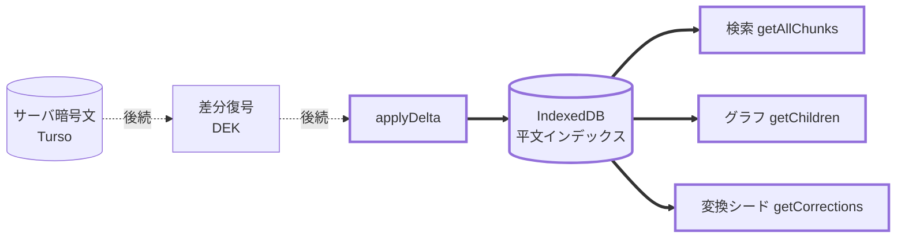

# クライアント平文インデックス（IndexedDB ストア本体）

issue #28 項目2 の共通基盤。復号済みレプリカを IndexedDB に保持し、検索・グラフ表示・
解析・変換シードをこれに対して行う（毎回の復号・サーバ往復を避ける）。

## スコープ（この PR）

**平文レコードを格納・差分適用・クエリする純ストレージのみ**。疎結合のため、
以下は**含めない**（後続スライス）:

- サーバ暗号文の fetch / DEK 復号（`applyDelta` へ渡す前段）
- 解析・変換のクライアント wasm 移設（#26）
- サーバ全クエリ層からの `getCrypto` 撤去（#28 項目1）

ストアは「渡されたレコードは既に平文」という前提で全チャンクを一律に扱う
（日付チャンクの content は元から平文 = date と同値。ストア視点では特別扱い不要）。

## データフロー（この PR = 太線部のみ）

## オブジェクトストア（スキーマ）

| store             | keyPath | index                 | レコード                                                       |
| ----------------- | ------- | --------------------- | -------------------------------------------------------------- |
| `chunks`          | `id`    | `by_parent`(parentId) | `{id, parentId, position, content, date, polarity, updatedAt}` |
| `chunk_user_tags` | `id`    | `by_chunk`(chunkId)   | `{id, chunkId, name}`                                          |
| `tags`            | `id`    | —                     | `{id, name}`                                                   |
| `corrections`     | `kana`  | —                     | `{kana, chosen, updatedAt}`                                    |
| `meta`            | `key`   | —                     | `{key, value}`（同期カーソル）                                 |

- DB 名は既定 `zakki-index`、version 1。テストは一意名で分離する。
- `applyDelta` は影響ストアをまたぐ 1 つの `readwrite` トランザクションで適用する。

## 要件チェックリスト（1 項目 = テスト 1 つ）

### ストア初期化・スキーマ

- [ ] 1. `openPlaintextIndex(name)` は object store 一式
     `{chunks, chunk_user_tags, tags, corrections, meta}` を持つ DB を作る
- [ ] 2. 同名 DB を開き直すと、格納済みレコードが保持される（再オープンで消えない）

### chunks

- [ ] 3. `putChunk(c)` 後の `getChunk(c.id)` は同じレコードを返す（round-trip）
- [ ] 4. 未登録 id の `getChunk` は `undefined`
- [ ] 5. `getChildren(parentId)` は当該 parentId のチャンクのみを **position 昇順**で返す
- [ ] 6. `getAllChunks()` は全チャンクを返す（検索用）
- [ ] 7. `deleteChunk(id)` 後、その `getChunk` は `undefined`

### chunk_user_tags

- [ ] 8. `putUserTag` 後の `getUserTagsByChunk(chunkId)` は当該チャンクのタグを返す
- [ ] 9. `deleteUserTag(id)` でそのタグが消える

### tags

- [ ] 10. `putTag` / `getTag` が round-trip し、`deleteTag(id)` で消える

### corrections（変換シード）

- [ ] 11. `putCorrection` 後の `getCorrections()` は `Map<kana, chosen>` を返す

### 同期カーソル

- [ ] 12. 初期状態の `getCursor()` は `undefined`。`setCursor(v)` 後は `v` を返す

### applyDelta（差分同期の適用点）

- [ ] 13. `applyDelta` は 1 回の呼び出しで chunks / userTags / tags / corrections の
      upsert を全ストアへ反映する
- [ ] 14. `applyDelta` の delete 指定（各ストアの id 群）が反映される
- [ ] 15. `applyDelta` に cursor を渡すとカーソルが前進する
- [ ] 16. `applyDelta` は冪等: 同じ delta を 2 回適用しても重複せず同一状態
      （初回フル同期 = 全件を applyDelta するのと等価）

## 設計判断（PR に記載・ユーザ確認は求めず既定採用）

- 配置: `apps/web/src/client/store/plaintext-index.ts`。将来 #29 の二層抽象で再配置しうる
- 復号・同期は本 PR 対象外（疎結合）。ストアは平文レコード前提で一律に扱う
- delete のカスケードはストアでは行わない（サーバ差分が子孫の delete も含めて送る前提）
