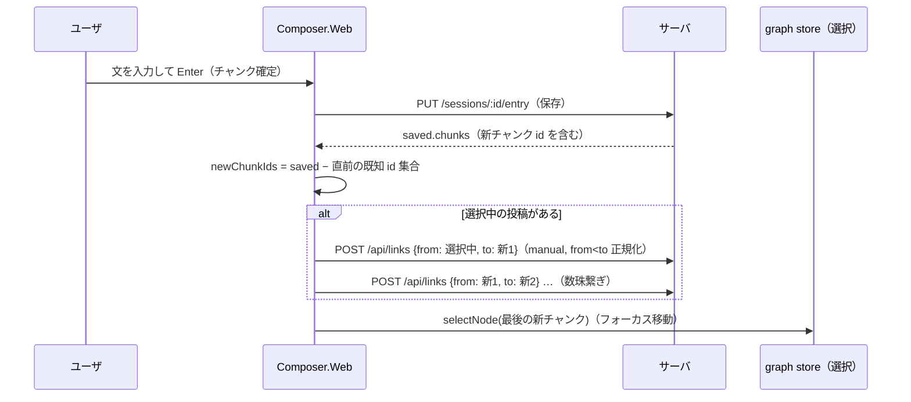
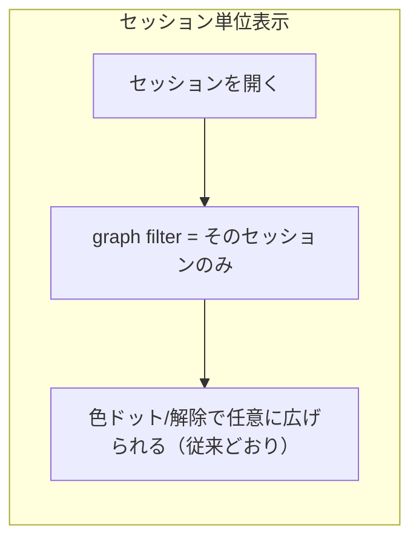

# Web UI: グラフのセッション単位表示・自動リンク・チャンク結合バグ修正

## 背景

- グラフビューが全ノードを常時表示している → 現在開いているセッション単位の表示に変える
- ノードのラベルが「ズーム時のみ makeTitle」→ 本文を clamp して常時表示する
- 左メニューのデフォルトセッションが「（日次）」表示 → `YYYY-MM-DD` そのものをタイトルにする
- 新規チャンクは「選択中の投稿」へ自動リンクし、フォーカス（選択）が新チャンクへ移って数珠繋ぎになるようにする
- **バグ**: Enter 区切りで複数チャンクを入力すると 1 投稿に結合される

## バグの原因（再現済み）

凍結リテラル（PUA マーカー）の境界が唯一のチャンク境界になるケース（Enter 終端・句点なし）で、
保存経路が `stripPasteMarkers` 済みの converted を `chunkText` に渡しているため境界が消える。
`chunkText` はマーカーを理解し原子チャンクとして扱える（`packages/core/src/chunk/chunker.ts`）のに、
その手前で情報を捨てている。TUI も同経路（`persistEntry`）で同じバグを持つ。

修正方針（深い側で直す）:
- `createConversionSession.convertRaw` はマーカーを **温存** して返す（表示用の `convertLive` は strip のまま）
- `persistEntry` / `saveSessionEntry` は「チャンク化はマーカー付きで、`entries.converted` の保存値は strip して」行う
  （strip 済み入力には no-op なので後方互換）

## 振る舞い（新規チャンクの自動リンク）

## チェックリスト（1 項目 = テスト 1 つ）

### バグ修正: チャンク境界の喪失

- [x] `convertRaw` は凍結リテラルのマーカーを温存する（`compose.ts`: 凍結2文を含む raw → 戻り値にマーカーが残る）
- [x] `convertLive` は strip 済みを返す（マーカーを含まない）
- [x] `persistEntry` はマーカー付き converted から複数チャンクを保存し、`entries.converted` は strip 済みで格納する
- [x] `persistEntry` は strip 済み converted 入力でも従来どおり動く（後方互換）
- [x] E2E（core 合成）: `"bunichi\nbunni\n"` を identity 変換で凍結 → 保存 → chunks が 2 件になる（結合されない）

### グラフのセッション単位表示

- [x] graph store `focusSession(id)`: filter.sessionIds が `{id}` に置き換わる
- [x] セッションを開く（openSession/openToday 成功時）と `focusSession` が呼ばれる（store 統合: 現セッションのみ表示）
- [x] `visibleGraph`: filter.sessionIds={A} のとき A のノードのみ・両端可視のエッジのみ返す（既存挙動の回帰テスト）

### ノード本文の clamp 表示

- [x] `clampText("あいうえおかきくけこ", 5)` → `"あいうえお…"`（コードポイント単位・ellipsis 付与）
- [x] `clampText` は max 以下の文字列をそのまま返す（ellipsis なし）
- [x] `clampText` は改行を空白に畳んでから clamp する（複数行本文のラベル崩れ防止）
- [x] GraphView のラベルは `clampText(content)` を常時描画（ズーム閾値なし）※描画は目視確認

### メニューのセッション表示

- [x] `sessionTitle({name: null, date: "2026-07-05"})` → `"2026-07-05"`（（日次）廃止）
- [x] `sessionTitle({name: "調査", ...})` → `"調査"`（名前付きは従来どおり）

### 新規チャンクの自動リンク（数珠繋ぎ）

- [x] `newChunkIds(prev=[1,2], saved=[{id:1},{id:2},{id:3},{id:4}])` → `[3,4]`（保存応答から新チャンクを検出）
- [x] `chainLinks(anchor=10, newIds=[3,4])` → `[{from:10,to:3},{from:3,to:4}]`（数珠繋ぎのリンク列）
- [x] `chainLinks(anchor=null, newIds=[3])` → `[]`（選択なしはリンクを張らない）
- [x] data `addManualLink(db, a, b)`: from<to へ正規化して origin="manual" で保存・重複は no-op・自己リンク(a===b)は no-op
- [x] `addManualLink` で張った manual リンクは `analyzeAll` 後も残る（auto 張り替えに消されない）
- [x] route `POST /api/links {from,to}`: 200 で作成、graph に反映される。不正 body は 400
- [x] Composer: 保存応答で新チャンクがあれば chainLinks を POST し、`selectNode(最後の新チャンク)` を呼ぶ（純関数部分をテスト、配線は E2E で確認）

## 確定済みの細目（AskUserQuestion で確認済み）

1. 選択中の投稿が無いときの新規チャンクは**リンクなし**（選択だけ新チャンクへ移り、以降そこから数珠繋ぎ）
2. セッションを開くたびにグラフフィルタをそのセッションへ**毎回リセット**する
3. clamp は **12 文字** + ellipsis、ズームに関係なく常時表示
4. 選択中が別セッションのノードでも自動リンクを**張る**（クロスセッション許容）

## 実装対象ファイル

- `packages/core/src/conversion/compose.ts`（convertRaw の strip 撤去）
- `packages/data/src/entry/autosave.ts`（chunkText はマーカー付き・保存は strip）
- `packages/data/src/link/repository.ts`（新規: addManualLink）
- `apps/web/src/server/routes/graph.ts` or `links.ts`（POST /api/links）
- `apps/web/src/client/store/graph.ts`（focusSession / clampText / sessionTitle / newChunkIds / chainLinks は適所へ）
- `apps/web/src/client/graph/GraphView.tsx`・`layout/LeftSidebar.tsx`・`composer/Composer.tsx`・`store/session.ts`
